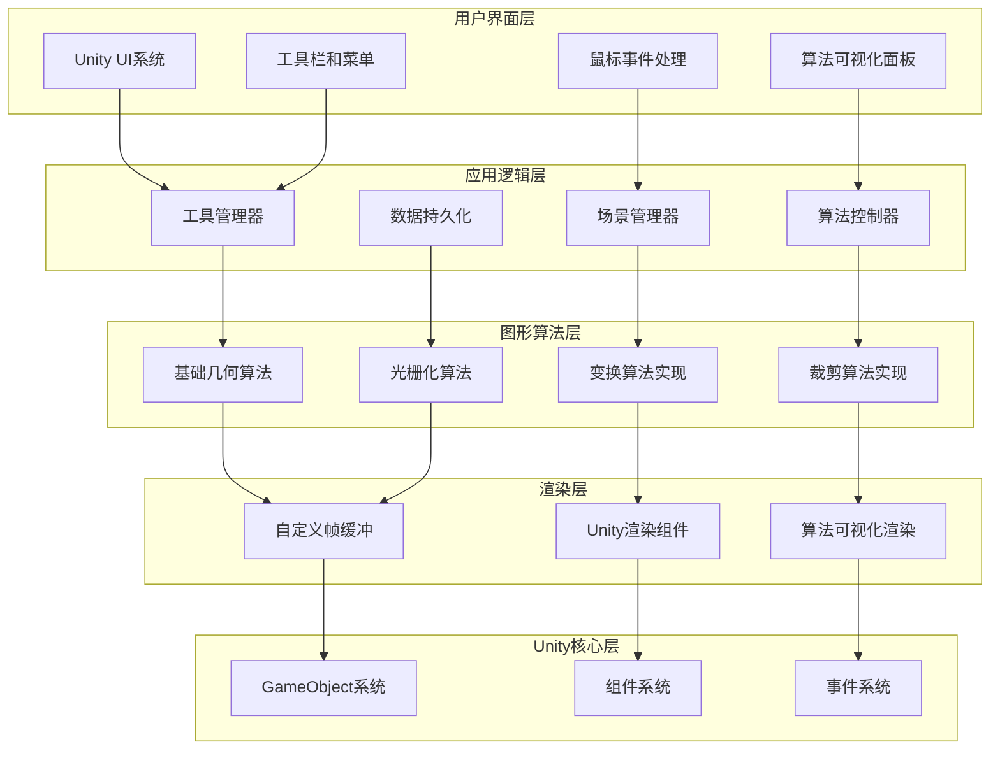
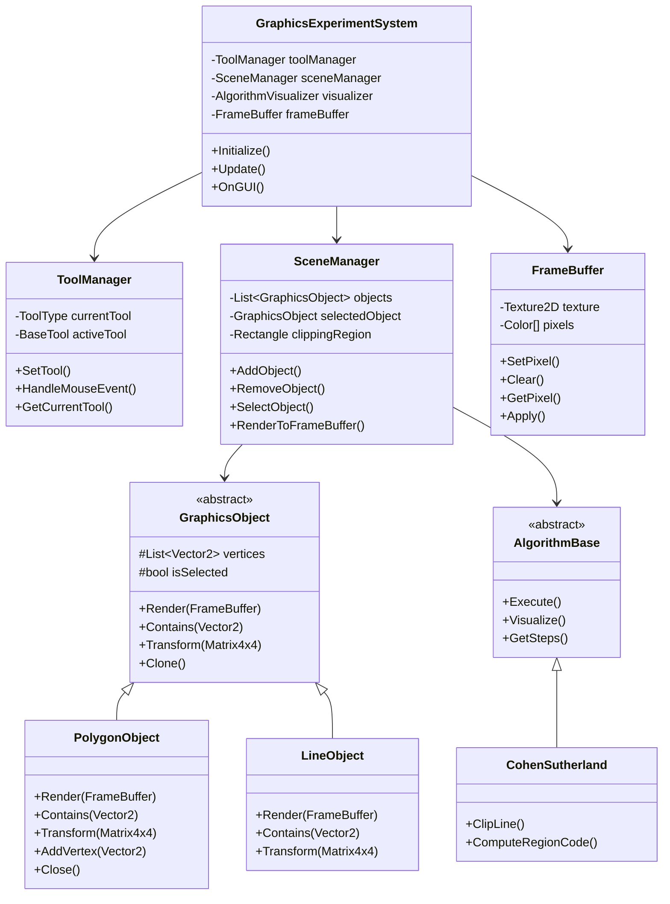
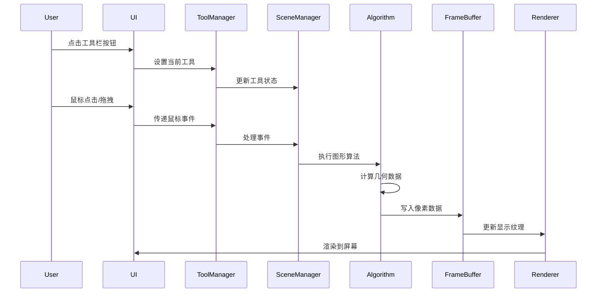
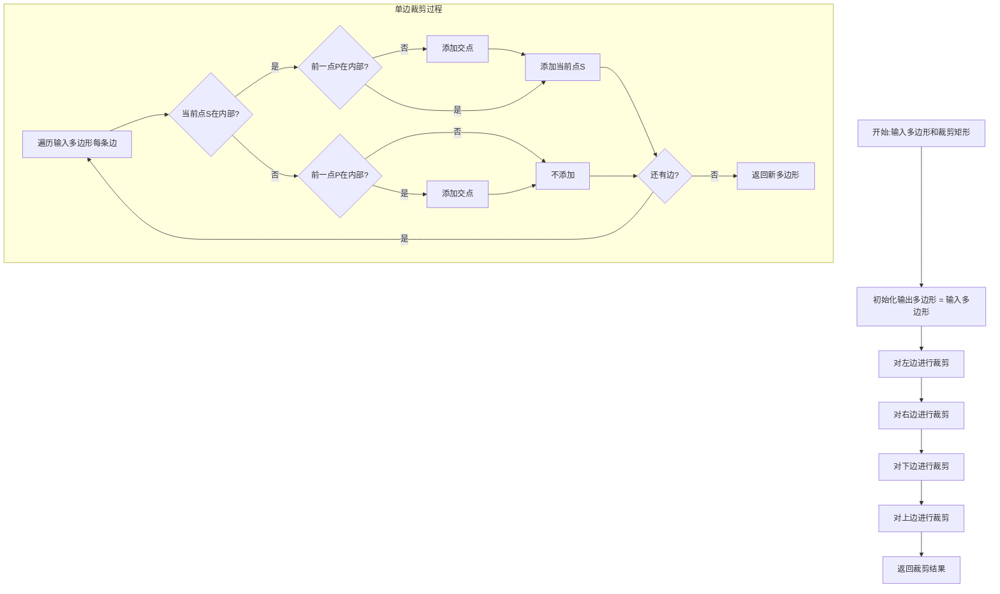
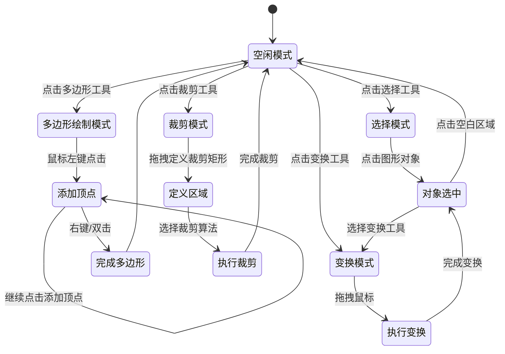

## 2. 设计文档

## 概述

Unity 2D图形学实验系统是一个基于Unity引擎的2D图形应用程序，专注于图形学算法的学习和验证。系统采用Unity的组件化架构，通过自定义渲染管线实现算法可视化。核心功能包括多边形绘制、几何变换和高级裁剪算法，所有算法都基于图形学原理实现，而非使用Unity的内置渲染功能。

## 架构

### 整体架构

系统采用分层架构设计，将算法实现、数据管理和用户界面分离：



### 主要模块关系图



### 数据流设计



## 组件和接口

### 核心MonoBehaviour组件

#### GraphicsExperimentController (主控制器)
```csharp
public class GraphicsExperimentController : MonoBehaviour
{
[Header("系统组件")]
[SerializeField] private ToolManager toolManager;
[SerializeField] private SceneManager sceneManager;
[SerializeField] private FrameBuffer frameBuffer;
[SerializeField] private AlgorithmVisualizer visualizer;

[Header("UI组件")]
[SerializeField] private Canvas uiCanvas;
[SerializeField] private RectTransform toolbar;
[SerializeField] private RectTransform statusBar;

[Header("配置")]
[SerializeField] private int frameBufferWidth = 800;
[SerializeField] private int frameBufferHeight = 600;
[SerializeField] private Color backgroundColor = Color.white;

private void Start()
{
    InitializeSystem();
}

private void InitializeSystem()
{
    // 初始化帧缓冲
    frameBuffer.Initialize(frameBufferWidth, frameBufferHeight);
    frameBuffer.Clear(backgroundColor);
    
    // 初始化场景管理器
    sceneManager.Initialize(frameBuffer);
    
    // 初始化工具管理器
    toolManager.Initialize(sceneManager);
    
    // 初始化可视化器
    visualizer.Initialize(sceneManager, frameBuffer);
}

private void Update()
{
    // 处理输入
    HandleInput();
    
    // 更新帧缓冲
    UpdateFrameBuffer();
}

private void OnGUI()
{
    // 绘制UI
    DrawUI();
}
}
```

### 工具系统设计

#### 工具类型枚举
```csharp
public enum ToolType
{
None,
PolygonDraw,        // 多边形绘制
LineDraw,           // 直线绘制
Select,             // 选择工具
Translate,          // 平移工具
Scale,              // 缩放工具
Rotate,             // 旋转工具
LineClipRegion,     // 定义直线裁剪区域
LineClipCohenSutherland, // Cohen-Sutherland直线裁剪
LineClipMidpoint,   // 中点分割直线裁剪
PolygonClipRegion,  // 定义多边形裁剪区域
PolygonClipSH,      // Sutherland-Hodgman多边形裁剪
PolygonClipWA,      // Weiler-Atherton多边形裁剪
Clear,              // 清空场景
Save,               // 保存场景
Load                // 加载场景
}
```

#### 工具管理器
```csharp
public class ToolManager : MonoBehaviour
{
private ToolType currentTool = ToolType.None;
private BaseTool activeTool;
private SceneManager sceneManager;

// 工具实例池
private Dictionary<ToolType, BaseTool> toolInstances = new Dictionary<ToolType, BaseTool>();

public void Initialize(SceneManager sceneMgr)
{
    this.sceneManager = sceneMgr;
    
    // 创建所有工具实例
    InitializeTools();
}

private void InitializeTools()
{
    toolInstances[ToolType.PolygonDraw] = new PolygonDrawTool();
    toolInstances[ToolType.Select] = new SelectTool();
    toolInstances[ToolType.Translate] = new TranslateTool();
    toolInstances[ToolType.Scale] = new ScaleTool();
    toolInstances[ToolType.Rotate] = new RotateTool();
    toolInstances[ToolType.LineClipCohenSutherland] = new LineClipCohenSutherlandTool();
    toolInstances[ToolType.LineClipMidpoint] = new LineClipMidpointTool();
    toolInstances[ToolType.PolygonClipSH] = new PolygonClipSHTool();
    toolInstances[ToolType.PolygonClipWA] = new PolygonClipWATool();
    
    // 初始化所有工具
    foreach (var tool in toolInstances.Values)
    {
        tool.Initialize(sceneManager);
    }
}

public void SetCurrentTool(ToolType toolType)
{
    if (currentTool == toolType) return;
    
    // 结束当前工具
    if (activeTool != null)
    {
        activeTool.OnToolEnd();
    }
    
    // 设置新工具
    currentTool = toolType;
    if (toolInstances.ContainsKey(toolType))
    {
        activeTool = toolInstances[toolType];
        activeTool.OnToolStart();
    }
    else
    {
        activeTool = null;
    }
    
    Debug.Log($"切换工具: {toolType}");
}

public void HandleMouseEvent(MouseEventData eventData)
{
    if (activeTool != null)
    {
        activeTool.HandleMouseEvent(eventData);
    }
}

public ToolType GetCurrentTool() => currentTool;
}
```

### 基础工具类
```csharp
public abstract class BaseTool
{
protected SceneManager sceneManager;
protected bool isActive = false;

public virtual void Initialize(SceneManager sceneMgr)
{
    this.sceneManager = sceneMgr;
}

public virtual void OnToolStart()
{
    isActive = true;
}

public virtual void OnToolEnd()
{
    isActive = false;
}

public abstract void HandleMouseEvent(MouseEventData eventData);

protected Vector2 ScreenToWorldPoint(Vector2 screenPoint)
{
    Camera camera = Camera.main;
    return camera.ScreenToWorldPoint(new Vector3(screenPoint.x, screenPoint.y, camera.nearClipPlane));
}
}

// 鼠标事件数据结构
public struct MouseEventData
{
public enum EventType
{
    MouseDown,
    MouseUp,
    MouseMove,
    MouseDrag,
    MouseClick,
    MouseDoubleClick,
    RightClick
}

public EventType type;
public Vector2 position;      // 屏幕坐标
public int button;           // 0-左键, 1-右键, 2-中键
public Vector2 delta;        // 移动增量
}
```

## 数据模型

### 基础数据结构

#### 2D几何结构
```csharp
// 二维点结构（带实用方法）
public struct Point2D
{
public float x;
public float y;

public Point2D(float x, float y)
{
    this.x = x;
    this.y = y;
}

public static Point2D operator +(Point2D a, Point2D b) => new Point2D(a.x + b.x, a.y + b.y);
public static Point2D operator -(Point2D a, Point2D b) => new Point2D(a.x - b.x, a.y - b.y);
public static Point2D operator *(Point2D p, float scalar) => new Point2D(p.x * scalar, p.y * scalar);
public static Point2D operator /(Point2D p, float scalar) => new Point2D(p.x / scalar, p.y / scalar);

public float Magnitude => Mathf.Sqrt(x * x + y * y);
public Point2D Normalized => new Point2D(x / Magnitude, y / Magnitude);

public float DistanceTo(Point2D other)
{
    float dx = x - other.x;
    float dy = y - other.y;
    return Mathf.Sqrt(dx * dx + dy * dy);
}

public static implicit operator Vector2(Point2D p) => new Vector2(p.x, p.y);
public static implicit operator Point2D(Vector2 v) => new Point2D(v.x, v.y);
}

// 矩形结构
public struct Rectangle2D
{
    public float xMin;
    public float yMin;
    public float xMax;
    public float yMax;
    
    public Rectangle2D(float x, float y, float width, float height)
    {
        xMin = x;
        yMin = y;
        xMax = x + width;
        yMax = y + height;
    }
    
    public float Width => xMax - xMin;
    public float Height => yMax - yMin;
    public Point2D Center => new Point2D((xMin + xMax) * 0.5f, (yMin + yMax) * 0.5f);
    
    public bool Contains(Point2D point)
    {
        return point.x >= xMin && point.x <= xMax && 
               point.y >= yMin && point.y <= yMax;
    }
    
    public bool Intersects(Rectangle2D other)
    {
        return xMin <= other.xMax && xMax >= other.xMin &&
               yMin <= other.yMax && yMax >= other.yMin;
    }
}
```

#### 变换矩阵
```csharp
// 3x3变换矩阵（用于2D变换）
public struct Matrix3x3
{
    public float m00, m01, m02;
    public float m10, m11, m12;
    public float m20, m21, m22;
    
    public static Matrix3x3 Identity => new Matrix3x3(
        1, 0, 0,
        0, 1, 0,
        0, 0, 1
    );
    
    public Matrix3x3(
        float m00, float m01, float m02,
        float m10, float m11, float m12,
        float m20, float m21, float m22)
    {
        this.m00 = m00; this.m01 = m01; this.m02 = m02;
        this.m10 = m10; this.m11 = m11; this.m12 = m12;
        this.m20 = m20; this.m21 = m21; this.m22 = m22;
    }
    
    // 平移矩阵
    public static Matrix3x3 Translation(float tx, float ty)
    {
        return new Matrix3x3(
            1, 0, tx,
            0, 1, ty,
            0, 0, 1
        );
    }
    
    // 缩放矩阵（相对于原点）
    public static Matrix3x3 Scaling(float sx, float sy)
    {
        return new Matrix3x3(
            sx, 0, 0,
            0, sy, 0,
            0, 0, 1
        );
    }
    
    // 缩放矩阵（相对于指定点）
    public static Matrix3x3 Scaling(float sx, float sy, Point2D center)
    {
        // T(-center) * S(sx, sy) * T(center)
        var t1 = Translation(-center.x, -center.y);
        var s = Scaling(sx, sy);
        var t2 = Translation(center.x, center.y);
        return t2 * s * t1;
    }
    
    // 旋转矩阵（相对于原点）
    public static Matrix3x3 Rotation(float angle)
    {
        float rad = angle * Mathf.Deg2Rad;
        float cos = Mathf.Cos(rad);
        float sin = Mathf.Sin(rad);
        
        return new Matrix3x3(
            cos, -sin, 0,
            sin, cos, 0,
            0, 0, 1
        );
    }
    
    // 旋转矩阵（相对于指定点）
    public static Matrix3x3 Rotation(float angle, Point2D center)
    {
        // T(-center) * R(angle) * T(center)
        var t1 = Translation(-center.x, -center.y);
        var r = Rotation(angle);
        var t2 = Translation(center.x, center.y);
        return t2 * r * t1;
    }
    
    // 矩阵乘法
    public static Matrix3x3 operator *(Matrix3x3 a, Matrix3x3 b)
    {
        return new Matrix3x3(
            a.m00 * b.m00 + a.m01 * b.m10 + a.m02 * b.m20,
            a.m00 * b.m01 + a.m01 * b.m11 + a.m02 * b.m21,
            a.m00 * b.m02 + a.m01 * b.m12 + a.m02 * b.m22,
            
            a.m10 * b.m00 + a.m11 * b.m10 + a.m12 * b.m20,
            a.m10 * b.m01 + a.m11 * b.m11 + a.m12 * b.m21,
            a.m10 * b.m02 + a.m11 * b.m12 + a.m12 * b.m22,
            
            a.m20 * b.m00 + a.m21 * b.m10 + a.m22 * b.m20,
            a.m20 * b.m01 + a.m21 * b.m11 + a.m22 * b.m21,
            a.m20 * b.m02 + a.m21 * b.m12 + a.m22 * b.m22
        );
    }
    
    // 变换点
    public Point2D TransformPoint(Point2D point)
    {
        float x = m00 * point.x + m01 * point.y + m02;
        float y = m10 * point.x + m11 * point.y + m12;
        float w = m20 * point.x + m21 * point.y + m22;
        
        return new Point2D(x / w, y / w);
    }
}
```

### 图形对象系统

#### 图形对象基类
```csharp
public abstract class GraphicsObject
{
    // 唯一标识符
    public Guid Id { get; private set; }
    
    // 顶点列表
    protected List<Point2D> vertices = new List<Point2D>();
    
    // 属性
    public Color Color { get; set; } = Color.black;
    public bool IsSelected { get; set; } = false;
    public bool IsVisible { get; set; } = true;
    public string Name { get; set; } = "未命名图形";
    
    // 变换信息
    protected Matrix3x3 transformMatrix = Matrix3x3.Identity;
    
    protected GraphicsObject()
    {
        Id = Guid.NewGuid();
    }
    
    // 获取变换后的顶点
    public IReadOnlyList<Point2D> GetTransformedVertices()
    {
        var result = new List<Point2D>();
        foreach (var vertex in vertices)
        {
            result.Add(transformMatrix.TransformPoint(vertex));
        }
        return result;
    }
    
    // 获取原始顶点
    public IReadOnlyList<Point2D> GetVertices() => vertices;
    
    // 应用变换
    public virtual void ApplyTransform(Matrix3x3 matrix)
    {
        // 累积变换
        transformMatrix = matrix * transformMatrix;
    }
    
    // 重置变换
    public void ResetTransform()
    {
        transformMatrix = Matrix3x3.Identity;
    }
    
    // 绘制到帧缓冲
    public abstract void Render(FrameBuffer frameBuffer);
    
    // 碰撞检测
    public abstract bool Contains(Point2D point, float tolerance = 0.1f);
    
    // 克隆
    public abstract GraphicsObject Clone();
    
    // 获取包围盒
    public virtual Rectangle2D GetBoundingBox()
    {
        if (vertices.Count == 0) return new Rectangle2D(0, 0, 0, 0);
        
        var transformedVertices = GetTransformedVertices();
        float xMin = transformedVertices[0].x;
        float yMin = transformedVertices[0].y;
        float xMax = transformedVertices[0].x;
        float yMax = transformedVertices[0].y;
        
        for (int i = 1; i < transformedVertices.Count; i++)
        {
            var vertex = transformedVertices[i];
            xMin = Mathf.Min(xMin, vertex.x);
            yMin = Mathf.Min(yMin, vertex.y);
            xMax = Mathf.Max(xMax, vertex.x);
            yMax = Mathf.Max(yMax, vertex.y);
        }
        
        return new Rectangle2D(xMin, yMin, xMax - xMin, yMax - yMin);
    }
}
```

#### 多边形对象
```csharp
public class PolygonObject : GraphicsObject
{
    private bool isComplete = false;
    private List<Point2D> tempVertices = new List<Point2D>();
    
    public bool IsComplete => isComplete;
    
    // 添加顶点
    public void AddVertex(Point2D vertex)
    {
        if (!isComplete)
        {
            vertices.Add(vertex);
        }
    }
    
    // 闭合多边形
    public void Close()
    {
        if (vertices.Count >= 3 && !isComplete)
        {
            isComplete = true;
        }
    }
    
    // 设置是否完成
    public void SetComplete(bool complete)
    {
        isComplete = complete;
    }
    
    // 绘制多边形
    public override void Render(FrameBuffer frameBuffer)
    {
        if (!IsVisible) return;
        
        var transformedVertices = GetTransformedVertices();
        
        if (transformedVertices.Count < 2) return;
        
        // 绘制边
        for (int i = 0; i < transformedVertices.Count; i++)
        {
            int j = (i + 1) % transformedVertices.Count;
            DrawLine(frameBuffer, transformedVertices[i], transformedVertices[j]);
        }
        
        // 如果未完成，绘制临时顶点和边
        if (!isComplete && transformedVertices.Count > 0)
        {
            // 绘制顶点
            foreach (var vertex in transformedVertices)
            {
                DrawVertex(frameBuffer, vertex);
            }
        }
    }
    
    private void DrawLine(FrameBuffer fb, Point2D start, Point2D end)
    {
        // 使用Bresenham算法绘制直线
        BresenhamLineDrawer.DrawLine(fb, start, end, IsSelected ? Color.red : Color);
    }
    
    private void DrawVertex(FrameBuffer fb, Point2D vertex)
    {
        // 绘制小方块表示顶点
        int size = 3;
        for (int dx = -size; dx <= size; dx++)
        {
            for (int dy = -size; dy <= size; dy++)
            {
                int x = Mathf.RoundToInt(vertex.x) + dx;
                int y = Mathf.RoundToInt(vertex.y) + dy;
                fb.SetPixel(x, y, Color.blue);
            }
        }
    }
    
    public override bool Contains(Point2D point, float tolerance = 0.1f)
    {
        // 使用射线法判断点是否在多边形内
        var transformedVertices = GetTransformedVertices();
        if (transformedVertices.Count < 3) return false;
        
        bool inside = false;
        for (int i = 0, j = transformedVertices.Count - 1; i < transformedVertices.Count; j = i++)
        {
            var vi = transformedVertices[i];
            var vj = transformedVertices[j];
            
            // 检查点是否在边上
            if (IsPointOnLineSegment(point, vj, vi, tolerance))
                return true;
            
            // 射线法核心逻辑
            if (((vi.y > point.y) != (vj.y > point.y)) &&
                (point.x < (vj.x - vi.x) * (point.y - vi.y) / (vj.y - vi.y) + vi.x))
            {
                inside = !inside;
            }
        }
        
        return inside;
    }
    
    private bool IsPointOnLineSegment(Point2D p, Point2D a, Point2D b, float tolerance)
    {
        // 检查点p是否在线段ab上
        float cross = (p.y - a.y) * (b.x - a.x) - (p.x - a.x) * (b.y - a.y);
        if (Mathf.Abs(cross) > tolerance) return false;
        
        float dot = (p.x - a.x) * (b.x - a.x) + (p.y - a.y) * (b.y - a.y);
        if (dot < 0) return false;
        
        float squaredLength = (b.x - a.x) * (b.x - a.x) + (b.y - a.y) * (b.y - a.y);
        if (dot > squaredLength) return false;
        
        return true;
    }
    
    public override GraphicsObject Clone()
    {
        var clone = new PolygonObject();
        clone.vertices = new List<Point2D>(this.vertices);
        clone.Color = this.Color;
        clone.Name = this.Name + " (副本)";
        clone.transformMatrix = this.transformMatrix;
        clone.isComplete = this.isComplete;
        return clone;
    }
}
```

#### 直线对象
```csharp
public class LineObject : GraphicsObject
{
    public Point2D StartPoint
    {
        get => vertices.Count > 0 ? GetTransformedVertices()[0] : new Point2D(0, 0);
        set
        {
            if (vertices.Count == 0) vertices.Add(value);
            else vertices[0] = value;
        }
    }
    
    public Point2D EndPoint
    {
        get => vertices.Count > 1 ? GetTransformedVertices()[1] : new Point2D(0, 0);
        set
        {
            if (vertices.Count < 2) vertices.Add(value);
            else vertices[1] = value;
        }
    }
    
    public LineObject(Point2D start, Point2D end)
    {
        vertices.Add(start);
        vertices.Add(end);
    }
    
    public override void Render(FrameBuffer frameBuffer)
    {
        if (!IsVisible) return;
        
        var transformedVertices = GetTransformedVertices();
        if (transformedVertices.Count < 2) return;
        
        // 使用Bresenham算法绘制直线
        BresenhamLineDrawer.DrawLine(frameBuffer, 
            transformedVertices[0], 
            transformedVertices[1], 
            IsSelected ? Color.red : Color);
    }
    
    public override bool Contains(Point2D point, float tolerance = 0.1f)
    {
        var transformedVertices = GetTransformedVertices();
        if (transformedVertices.Count < 2) return false;
        
        return IsPointOnLineSegment(point, transformedVertices[0], transformedVertices[1], tolerance);
    }
    
    private bool IsPointOnLineSegment(Point2D p, Point2D a, Point2D b, float tolerance)
    {
        // 检查点p是否在线段ab上
        float cross = (p.y - a.y) * (b.x - a.x) - (p.x - a.x) * (b.y - a.y);
        if (Mathf.Abs(cross) > tolerance) return false;
        
        float dot = (p.x - a.x) * (b.x - a.x) + (p.y - a.y) * (b.y - a.y);
        if (dot < 0) return false;
        
        float squaredLength = (b.x - a.x) * (b.x - a.x) + (b.y - a.y) * (b.y - a.y);
        if (dot > squaredLength) return false;
        
        return true;
    }
    
    public override GraphicsObject Clone()
    {
        var clone = new LineObject(StartPoint, EndPoint);
        clone.Color = this.Color;
        clone.Name = this.Name + " (副本)";
        clone.transformMatrix = this.transformMatrix;
        return clone;
    }
}
```

### 场景管理器
```csharp
public class SceneManager : MonoBehaviour
{
    private List<GraphicsObject> objects = new List<GraphicsObject>();
    private GraphicsObject selectedObject = null;
    private Rectangle2D clippingRegion = new Rectangle2D(0, 0, 0, 0);
    
    // 帧缓冲引用
    private FrameBuffer frameBuffer;
    
    // 事件
    public event Action OnSceneChanged;
    public event Action<GraphicsObject> OnObjectSelected;
    
    public void Initialize(FrameBuffer fb)
    {
        this.frameBuffer = fb;
    }
    
    // 添加对象
    public void AddObject(GraphicsObject obj)
    {
        objects.Add(obj);
        OnSceneChanged?.Invoke();
    }
    
    // 移除对象
    public void RemoveObject(GraphicsObject obj)
    {
        if (objects.Contains(obj))
        {
            objects.Remove(obj);
            if (selectedObject == obj)
                selectedObject = null;
            OnSceneChanged?.Invoke();
        }
    }
    
    // 选择对象
    public GraphicsObject SelectObject(Point2D point)
    {
        // 反向遍历，最后添加的对象在最上面
        for (int i = objects.Count - 1; i >= 0; i--)
        {
            if (objects[i].Contains(point))
            {
                // 清除之前的选择
                if (selectedObject != null)
                    selectedObject.IsSelected = false;
                
                // 设置新的选择
                selectedObject = objects[i];
                selectedObject.IsSelected = true;
                
                OnObjectSelected?.Invoke(selectedObject);
                return selectedObject;
            }
        }
        
        // 点击空白区域，清除选择
        if (selectedObject != null)
        {
            selectedObject.IsSelected = false;
            selectedObject = null;
            OnObjectSelected?.Invoke(null);
        }
        
        return null;
    }
    
    // 获取选中对象
    public GraphicsObject GetSelectedObject() => selectedObject;
    
    // 清空场景
    public void ClearScene()
    {
        objects.Clear();
        selectedObject = null;
        OnSceneChanged?.Invoke();
    }
    
    // 渲染所有对象到帧缓冲
    public void RenderToFrameBuffer()
    {
        if (frameBuffer == null) return;
        
        // 先清空帧缓冲
        frameBuffer.Clear(Color.white);
        
        // 绘制裁剪区域（如果存在）
        if (clippingRegion.Width > 0 && clippingRegion.Height > 0)
        {
            DrawClippingRegion();
        }
        
        // 绘制所有对象
        foreach (var obj in objects)
        {
            obj.Render(frameBuffer);
        }
        
        // 应用帧缓冲
        frameBuffer.Apply();
    }
    
    // 设置裁剪区域
    public void SetClippingRegion(Rectangle2D region)
    {
        clippingRegion = region;
        OnSceneChanged?.Invoke();
    }
    
    // 获取裁剪区域
    public Rectangle2D GetClippingRegion() => clippingRegion;
    
    // 获取所有对象
    public IReadOnlyList<GraphicsObject> GetAllObjects() => objects;
    
    // 绘制裁剪区域
    private void DrawClippingRegion()
    {
        // 绘制矩形边框
        Point2D p1 = new Point2D(clippingRegion.xMin, clippingRegion.yMin);
        Point2D p2 = new Point2D(clippingRegion.xMax, clippingRegion.yMin);
        Point2D p3 = new Point2D(clippingRegion.xMax, clippingRegion.yMax);
        Point2D p4 = new Point2D(clippingRegion.xMin, clippingRegion.yMax);
        
        BresenhamLineDrawer.DrawLine(frameBuffer, p1, p2, new Color(0, 1, 0, 0.5f));
        BresenhamLineDrawer.DrawLine(frameBuffer, p2, p3, new Color(0, 1, 0, 0.5f));
        BresenhamLineDrawer.DrawLine(frameBuffer, p3, p4, new Color(0, 1, 0, 0.5f));
        BresenhamLineDrawer.DrawLine(frameBuffer, p4, p1, new Color(0, 1, 0, 0.5f));
    }
}
```

## 正确性属性

### 图形算法属性

#### 属性1: 多边形绘制完整性
*对于任意*多边形顶点序列，当完成多边形绘制时，多边形应该被正确闭合且所有顶点顺序连接
**验证:需求 1.3, 1.5**

#### 属性2: 顶点添加正确性
*对于任意*鼠标点击坐标，在多边形绘制模式下点击鼠标时，该坐标应该被准确添加到多边形的顶点列表中
**验证:需求 1.2**

#### 属性3: 变换矩阵一致性
*对于任意*图形对象和变换矩阵，应用变换后对象的坐标应该与矩阵乘法结果一致
**验证:需求 2.2, 2.3, 2.4**

#### 属性4: 选择状态互斥性
*对于任意*图形对象，当选择新对象时，之前选中的对象应该自动取消选择状态
**验证:需求 2.1**

#### 属性5: 裁剪区域定义正确性
*对于任意*鼠标拖拽操作，在裁剪模式下定义的矩形区域应该与拖拽起始点和结束点一致
**验证:需求 3.1, 4.1**

#### 属性6: 算法等价性
*对于任意*直线和矩形裁剪区域，Cohen-Sutherland算法和中点分割算法应该产生相同的裁剪结果
**验证:需求 3.2, 3.3**

#### 属性7: 裁剪结果边界约束
*对于任意*被裁剪的图形对象，裁剪后的结果应该完全位于裁剪矩形区域内
**验证:需求 3.4, 4.4**

#### 属性8: 算法隔离性
*对于任意*裁剪操作，非目标类型的图形对象应该保持完全不变
**验证:需求 3.5, 4.5**

#### 属性9: 多边形裁剪正确性
*对于任意*多边形和矩形裁剪区域，Sutherland-Hodgman算法和Weiler-Atherton算法应该正确处理所有边界情况
**验证:需求 4.2, 4.3**

#### 属性10: 帧缓冲一致性
*对于任意*渲染操作，帧缓冲中的像素数据应该准确反映图形对象的几何形状
**验证:需求 6.1**

### 系统属性

#### 属性11: 工具状态同步
*对于任意*工具切换操作，UI显示的工具状态应该与系统内部状态完全一致
**验证:需求 5.2, 5.3**

#### 属性12: 事件响应及时性
*对于任意*用户输入事件，系统应该在单帧内完成处理并更新显示
**验证:需求 2.5**

#### 属性13: 资源管理正确性
*对于任意*操作序列，系统不应该出现内存泄漏或资源未释放的情况
**验证:需求 6.1**

## 几何算法实现

### 基础绘制算法

#### Bresenham直线绘制算法
```csharp
public static class BresenhamLineDrawer
{
    public static void DrawLine(FrameBuffer frameBuffer, Point2D start, Point2D end, Color color)
    {
        int x0 = Mathf.RoundToInt(start.x);
        int y0 = Mathf.RoundToInt(start.y);
        int x1 = Mathf.RoundToInt(end.x);
        int y1 = Mathf.RoundToInt(end.y);
        
        bool steep = Mathf.Abs(y1 - y0) > Mathf.Abs(x1 - x0);
        
        if (steep)
        {
            Swap(ref x0, ref y0);
            Swap(ref x1, ref y1);
        }
        
        if (x0 > x1)
        {
            Swap(ref x0, ref x1);
            Swap(ref y0, ref y1);
        }
        
        int dx = x1 - x0;
        int dy = Mathf.Abs(y1 - y0);
        int error = dx / 2;
        int ystep = (y0 < y1) ? 1 : -1;
        int y = y0;
        
        for (int x = x0; x <= x1; x++)
        {
            if (steep)
                frameBuffer.SetPixel(y, x, color);
            else
                frameBuffer.SetPixel(x, y, color);
            
            error -= dy;
            if (error < 0)
            {
                y += ystep;
                error += dx;
            }
        }
    }
    
    private static void Swap(ref int a, ref int b)
    {
        int temp = a;
        a = b;
        b = temp;
    }
}
```

### 裁剪算法实现

#### Cohen-Sutherland直线裁剪算法
```csharp
public static class CohenSutherlandClipper
{
    // 区域编码
    private const int INSIDE = 0;  // 0000
    private const int LEFT   = 1;  // 0001
    private const int RIGHT  = 2;  // 0010
    private const int BOTTOM = 4;  // 0100
    private const int TOP    = 8;  // 1000
    
    public static bool ClipLine(ref Point2D p1, ref Point2D p2, Rectangle2D clipRect)
    {
        int code1 = ComputeRegionCode(p1, clipRect);
        int code2 = ComputeRegionCode(p2, clipRect);
        bool accept = false;
        
        while (true)
        {
            if ((code1 == 0) && (code2 == 0))
            {
                // 完全在内部
                accept = true;
                break;
            }
            else if ((code1 & code2) != 0)
            {
                // 完全在外部
                break;
            }
            else
            {
                // 部分在内部，需要裁剪
                int codeOut = code1 != 0 ? code1 : code2;
                Point2D p = new Point2D();
                
                // 计算交点
                if ((codeOut & TOP) != 0)
                {
                    // 与上边界相交
                    p.x = p1.x + (p2.x - p1.x) * (clipRect.yMax - p1.y) / (p2.y - p1.y);
                    p.y = clipRect.yMax;
                }
                else if ((codeOut & BOTTOM) != 0)
                {
                    // 与下边界相交
                    p.x = p1.x + (p2.x - p1.x) * (clipRect.yMin - p1.y) / (p2.y - p1.y);
                    p.y = clipRect.yMin;
                }
                else if ((codeOut & RIGHT) != 0)
                {
                    // 与右边界相交
                    p.y = p1.y + (p2.y - p1.y) * (clipRect.xMax - p1.x) / (p2.x - p1.x);
                    p.x = clipRect.xMax;
                }
                else if ((codeOut & LEFT) != 0)
                {
                    // 与左边界相交
                    p.y = p1.y + (p2.y - p1.y) * (clipRect.xMin - p1.x) / (p2.x - p1.x);
                    p.x = clipRect.xMin;
                }
                
                // 更新点
                if (codeOut == code1)
                {
                    p1 = p;
                    code1 = ComputeRegionCode(p1, clipRect);
                }
                else
                {
                    p2 = p;
                    code2 = ComputeRegionCode(p2, clipRect);
                }
            }
        }
        
        return accept;
    }
    
    private static int ComputeRegionCode(Point2D p, Rectangle2D rect)
    {
        int code = INSIDE;
        
        if (p.x < rect.xMin)
            code |= LEFT;
        else if (p.x > rect.xMax)
            code |= RIGHT;
        
        if (p.y < rect.yMin)
            code |= BOTTOM;
        else if (p.y > rect.yMax)
            code |= TOP;
        
        return code;
    }
}
```

#### 中点分割直线裁剪算法
```csharp
public static class MidpointDivisionClipper
{
    public static bool ClipLine(ref Point2D p1, ref Point2D p2, Rectangle2D clipRect, float epsilon = 0.01f)
    {
        return ClipLineRecursive(p1, p2, clipRect, epsilon, out p1, out p2);
    }
    
    private static bool ClipLineRecursive(Point2D a, Point2D b, Rectangle2D rect, float epsilon, 
                                         out Point2D outA, out Point2D outB)
    {
        outA = a;
        outB = b;
        
        // 检查线段是否完全在内部
        if (IsPointInside(a, rect) && IsPointInside(b, rect))
            return true;
        
        // 检查线段是否完全在外部
        if (IsCompletelyOutside(a, b, rect))
            return false;
        
        // 如果线段很短，直接检查端点
        float lengthSquared = (b.x - a.x) * (b.x - a.x) + (b.y - a.y) * (b.y - a.y);
        if (lengthSquared < epsilon * epsilon)
        {
            bool aInside = IsPointInside(a, rect);
            bool bInside = IsPointInside(b, rect);
            
            if (aInside && bInside)
                return true;
            else if (aInside)
            {
                outB = a;
                return true;
            }
            else if (bInside)
            {
                outA = b;
                return true;
            }
            else
                return false;
        }
        
        // 计算中点
        Point2D mid = new Point2D((a.x + b.x) * 0.5f, (a.y + b.y) * 0.5f);
        
        // 递归处理两个子段
        Point2D leftA, leftB, rightA, rightB;
        bool leftVisible = ClipLineRecursive(a, mid, rect, epsilon, out leftA, out leftB);
        bool rightVisible = ClipLineRecursive(mid, b, rect, epsilon, out rightA, out rightB);
        
        if (leftVisible && rightVisible)
        {
            // 两段都可见，合并
            outA = leftA;
            outB = rightB;
            return true;
        }
        else if (leftVisible)
        {
            outA = leftA;
            outB = leftB;
            return true;
        }
        else if (rightVisible)
        {
            outA = rightA;
            outB = rightB;
            return true;
        }
        else
        {
            return false;
        }
    }
    
    private static bool IsPointInside(Point2D p, Rectangle2D rect)
    {
        return p.x >= rect.xMin && p.x <= rect.xMax &&
               p.y >= rect.yMin && p.y <= rect.yMax;
    }
    
    private static bool IsCompletelyOutside(Point2D a, Point2D b, Rectangle2D rect)
    {
        // 检查线段是否完全在矩形的一侧
        if ((a.x < rect.xMin && b.x < rect.xMin) ||
            (a.x > rect.xMax && b.x > rect.xMax) ||
            (a.y < rect.yMin && b.y < rect.yMin) ||
            (a.y > rect.yMax && b.y > rect.yMax))
        {
            return true;
        }
        
        return false;
    }
}
```

#### Sutherland-Hodgman多边形裁剪算法流程图



#### Sutherland-Hodgman多边形裁剪实现
```csharp
public static class SutherlandHodgmanClipper
{
    public static List<Point2D> ClipPolygon(List<Point2D> polygon, Rectangle2D clipRect)
    {
        if (polygon == null || polygon.Count < 3)
            return new List<Point2D>();
        
        List<Point2D> output = new List<Point2D>(polygon);
        
        // 依次对四条边进行裁剪
        output = ClipAgainstEdge(output, clipRect.xMin, ClipEdge.Left);
        output = ClipAgainstEdge(output, clipRect.xMax, ClipEdge.Right);
        output = ClipAgainstEdge(output, clipRect.yMin, ClipEdge.Bottom);
        output = ClipAgainstEdge(output, clipRect.yMax, ClipEdge.Top);
        
        return output;
    }
    
    private enum ClipEdge { Left, Right, Bottom, Top }
    
    private static List<Point2D> ClipAgainstEdge(List<Point2D> input, float edge, ClipEdge edgeType)
    {
        if (input.Count == 0)
            return input;
        
        List<Point2D> output = new List<Point2D>();
        Point2D prevPoint = input[input.Count - 1];
        
        foreach (Point2D currPoint in input)
        {
            bool prevInside = IsInside(prevPoint, edge, edgeType);
            bool currInside = IsInside(currPoint, edge, edgeType);
            
            if (currInside)
            {
                // 当前点在内部
                if (!prevInside)
                {
                    // 前一点在外部，添加交点
                    Point2D intersection = ComputeIntersection(prevPoint, currPoint, edge, edgeType);
                    output.Add(intersection);
                }
                output.Add(currPoint);
            }
            else if (prevInside)
            {
                // 前一点在内部，当前点在外部，添加交点
                Point2D intersection = ComputeIntersection(prevPoint, currPoint, edge, edgeType);
                output.Add(intersection);
            }
            
            prevPoint = currPoint;
        }
        
        return output;
    }
    
    private static bool IsInside(Point2D p, float edge, ClipEdge edgeType)
    {
        switch (edgeType)
        {
            case ClipEdge.Left:   return p.x >= edge;
            case ClipEdge.Right:  return p.x <= edge;
            case ClipEdge.Bottom: return p.y >= edge;
            case ClipEdge.Top:    return p.y <= edge;
            default: return false;
        }
    }
    
    private static Point2D ComputeIntersection(Point2D p1, Point2D p2, float edge, ClipEdge edgeType)
    {
        float t = 0;
        
        switch (edgeType)
        {
            case ClipEdge.Left:
            case ClipEdge.Right:
                t = (edge - p1.x) / (p2.x - p1.x);
                return new Point2D(edge, p1.y + t * (p2.y - p1.y));
                
            case ClipEdge.Bottom:
            case ClipEdge.Top:
                t = (edge - p1.y) / (p2.y - p1.y);
                return new Point2D(p1.x + t * (p2.x - p1.x), edge);
                
            default:
                return p1;
        }
    }
}
```

#### Weiler-Atherton多边形裁剪算法
```csharp
public static class WeilerAthertonClipper
{
    public class ClipVertex
    {
        public Point2D Point { get; set; }
        public bool IsIntersection { get; set; }
        public bool IsEntry { get; set; } // true: 进入裁剪区域, false: 离开裁剪区域
        public ClipVertex Next { get; set; }
        public ClipVertex Previous { get; set; }
        public ClipVertex Corresponding { get; set; } // 对应的交点（如果此点是交点）
        
        public ClipVertex(Point2D point, bool isIntersection = false)
        {
            Point = point;
            IsIntersection = isIntersection;
        }
    }
    
    public static List<List<Point2D>> ClipPolygon(List<Point2D> subjectPolygon, List<Point2D> clipPolygon)
    {
        // 将裁剪多边形转换为顺时针
        clipPolygon = EnsureClockwise(clipPolygon);
        
        // 构建顶点链表
        ClipVertex subjectList = BuildVertexList(subjectPolygon, false);
        ClipVertex clipList = BuildVertexList(clipPolygon, true);
        
        // 计算交点并插入链表
        ComputeIntersections(subjectList, clipList);
        
        // 标记进出点
        MarkEntryExitPoints(subjectList, clipList);
        
        // 执行裁剪
        List<List<Point2D>> result = ExecuteClipping(subjectList);
        
        return result;
    }
    
    private static ClipVertex BuildVertexList(List<Point2D> polygon, bool isClipPolygon)
    {
        if (polygon.Count == 0) return null;
        
        ClipVertex first = null;
        ClipVertex prev = null;
        
        foreach (var point in polygon)
        {
            ClipVertex vertex = new ClipVertex(point);
            
            if (first == null)
                first = vertex;
            
            if (prev != null)
            {
                prev.Next = vertex;
                vertex.Previous = prev;
            }
            
            prev = vertex;
        }
        
        // 闭合链表
        if (prev != null && first != null)
        {
            prev.Next = first;
            first.Previous = prev;
        }
        
        return first;
    }
    
    private static void ComputeIntersections(ClipVertex subjectList, ClipVertex clipList)
    {
        // 这里实现交点计算逻辑
        // 由于复杂度较高，这里仅展示框架
        // 实际实现需要遍历所有边对，计算交点并插入链表
    }
    
    private static void MarkEntryExitPoints(ClipVertex subjectList, ClipVertex clipList)
    {
        // 标记进出点
        // 实际实现需要根据点在裁剪多边形内外的位置来标记
    }
    
    private static List<List<Point2D>> ExecuteClipping(ClipVertex subjectList)
    {
        List<List<Point2D>> result = new List<List<Point2D>>();
        
        // 执行裁剪算法
        // 实际实现需要遍历链表，收集裁剪结果
        
        return result;
    }
    
    private static List<Point2D> EnsureClockwise(List<Point2D> polygon)
    {
        // 计算多边形面积判断方向
        float area = 0;
        for (int i = 0; i < polygon.Count; i++)
        {
            int j = (i + 1) % polygon.Count;
            area += polygon[i].x * polygon[j].y - polygon[j].x * polygon[i].y;
        }
        
        // 如果面积为正，说明是逆时针，需要反转
        if (area > 0)
        {
            polygon.Reverse();
        }
        
        return polygon;
    }
}
```

### 帧缓冲系统

```csharp
public class FrameBuffer : MonoBehaviour
{
    [Header("帧缓冲设置")]
    [SerializeField] private int width = 800;
    [SerializeField] private int height = 600;
    [SerializeField] private FilterMode filterMode = FilterMode.Point;
    
    private Texture2D texture;
    private Color[] pixels;
    private bool isDirty = false;
    
    public Texture2D Texture => texture;
    public int Width => width;
    public int Height => height;
    
    public void Initialize(int width, int height)
    {
        this.width = width;
        this.height = height;
        
        // 创建纹理
        texture = new Texture2D(width, height, TextureFormat.RGBA32, false);
        texture.filterMode = filterMode;
        texture.wrapMode = TextureWrapMode.Clamp;
        
        // 初始化像素数组
        pixels = new Color[width * height];
        
        // 初始化为透明
        Clear(Color.white);
        
        Debug.Log($"帧缓冲初始化: {width}x{height}");
    }
    
    public void SetPixel(int x, int y, Color color)
    {
        if (x >= 0 && x < width && y >= 0 && y < height)
        {
            pixels[y * width + x] = color;
            isDirty = true;
        }
    }
    
    public Color GetPixel(int x, int y)
    {
        if (x >= 0 && x < width && y >= 0 && y < height)
            return pixels[y * width + x];
        return Color.clear;
    }
    
    public void Clear(Color color)
    {
        for (int i = 0; i < pixels.Length; i++)
        {
            pixels[i] = color;
        }
        isDirty = true;
        Apply();
    }
    
    public void Apply()
    {
        if (isDirty && texture != null)
        {
            texture.SetPixels(pixels);
            texture.Apply();
            isDirty = false;
        }
    }
    
    public void DrawLine(Point2D start, Point2D end, Color color)
    {
        BresenhamLineDrawer.DrawLine(this, start, end, color);
    }
    
    public void DrawRectangle(Rectangle2D rect, Color color)
    {
        Point2D p1 = new Point2D(rect.xMin, rect.yMin);
        Point2D p2 = new Point2D(rect.xMax, rect.yMin);
        Point2D p3 = new Point2D(rect.xMax, rect.yMax);
        Point2D p4 = new Point2D(rect.xMin, rect.yMax);
        
        DrawLine(p1, p2, color);
        DrawLine(p2, p3, color);
        DrawLine(p3, p4, color);
        DrawLine(p4, p1, color);
    }
    
    private void OnDestroy()
    {
        if (texture != null)
            Destroy(texture);
    }
}
```

### 算法可视化器

```csharp
public class AlgorithmVisualizer : MonoBehaviour
{
    [Header("可视化设置")]
    [SerializeField] private bool showAlgorithmSteps = true;
    [SerializeField] private float stepDelay = 0.5f;
    [SerializeField] private Color intersectionColor = Color.red;
    [SerializeField] private Color regionColor = new Color(0, 1, 0, 0.3f);
    
    private SceneManager sceneManager;
    private FrameBuffer frameBuffer;
    private Coroutine visualizationCoroutine;
    
    public void Initialize(SceneManager sceneMgr, FrameBuffer fb)
    {
        this.sceneManager = sceneMgr;
        this.frameBuffer = fb;
    }
    
    public void VisualizeCohenSutherland(LineObject line, Rectangle2D clipRect)
    {
        if (visualizationCoroutine != null)
            StopCoroutine(visualizationCoroutine);
        
        visualizationCoroutine = StartCoroutine(VisualizeCohenSutherlandCoroutine(line, clipRect));
    }
    
    private IEnumerator VisualizeCohenSutherlandCoroutine(LineObject line, Rectangle2D clipRect)
    {
        // 绘制裁剪区域
        frameBuffer.DrawRectangle(clipRect, regionColor);
        frameBuffer.Apply();
        yield return new WaitForSeconds(stepDelay);
        
        Point2D p1 = line.StartPoint;
        Point2D p2 = line.EndPoint;
        
        // 计算区域编码
        int code1 = ComputeRegionCode(p1, clipRect);
        int code2 = ComputeRegionCode(p2, clipRect);
        
        // 可视化区域编码
        VisualizeRegionCode(p1, code1, "P1");
        VisualizeRegionCode(p2, code2, "P2");
        frameBuffer.Apply();
        yield return new WaitForSeconds(stepDelay);
        
        // 执行算法步骤...
        // 这里可以逐步展示算法的每一步
        
        visualizationCoroutine = null;
    }
    
    private int ComputeRegionCode(Point2D p, Rectangle2D rect)
    {
        int code = 0; // INSIDE
        
        if (p.x < rect.xMin)
            code |= 1; // LEFT
        else if (p.x > rect.xMax)
            code |= 2; // RIGHT
        
        if (p.y < rect.yMin)
            code |= 4; // BOTTOM
        else if (p.y > rect.yMax)
            code |= 8; // TOP
        
        return code;
    }
    
    private void VisualizeRegionCode(Point2D p, int code, string label)
    {
        // 在点旁边显示区域编码
        int x = Mathf.RoundToInt(p.x);
        int y = Mathf.RoundToInt(p.y);
        
        // 绘制点
        for (int dx = -2; dx <= 2; dx++)
        {
            for (int dy = -2; dy <= 2; dy++)
            {
                frameBuffer.SetPixel(x + dx, y + dy, Color.blue);
            }
        }
        
        // 这里可以添加文本显示（通过UI或纹理绘制）
    }
}
```

## 用户界面设计

### Unity UI结构

```csharp
public class GraphicsUI : MonoBehaviour
{
    [Header("UI组件")]
    [SerializeField] private Canvas canvas;
    [SerializeField] private RectTransform toolbarPanel;
    [SerializeField] private RectTransform menuPanel;
    [SerializeField] private RectTransform statusPanel;
    [SerializeField] private RectTransform algorithmPanel;
    
    [Header("预制体")]
    [SerializeField] private GameObject toolButtonPrefab;
    [SerializeField] private GameObject menuItemPrefab;
    
    // 工具按钮图标
    [SerializeField] private Sprite polygonDrawIcon;
    [SerializeField] private Sprite selectIcon;
    [SerializeField] private Sprite translateIcon;
    [SerializeField] private Sprite scaleIcon;
    [SerializeField] private Sprite rotateIcon;
    [SerializeField] private Sprite clipIcon;
    
    private ToolManager toolManager;
    private Dictionary<ToolType, UIButton> toolButtons = new Dictionary<ToolType, UIButton>();
    
    public void Initialize(ToolManager toolMgr)
    {
        this.toolManager = toolMgr;
        CreateUI();
    }
    
    private void CreateUI()
    {
        CreateMenuBar();
        CreateToolbar();
        CreateStatusBar();
        CreateAlgorithmPanel();
    }
    
    private void CreateMenuBar()
    {
        // 创建菜单项
        CreateMenuItem("文件(F)", CreateFileMenu);
        CreateMenuItem("编辑(E)", CreateEditMenu);
        CreateMenuItem("绘制(D)", CreateDrawMenu);
        CreateMenuItem("变换(T)", CreateTransformMenu);
        CreateMenuItem("裁剪(C)", CreateClipMenu);
        CreateMenuItem("帮助(H)", CreateHelpMenu);
    }
    
    private void CreateToolbar()
    {
        // 绘制工具组
        CreateToolButton(ToolType.PolygonDraw, polygonDrawIcon, "绘制多边形");
        CreateToolButton(ToolType.LineDraw, null, "绘制直线");
        
        // 添加分隔符
        AddToolbarSeparator();
        
        // 选择和变换工具组
        CreateToolButton(ToolType.Select, selectIcon, "选择工具");
        CreateToolButton(ToolType.Translate, translateIcon, "平移工具");
        CreateToolButton(ToolType.Scale, scaleIcon, "缩放工具");
        CreateToolButton(ToolType.Rotate, rotateIcon, "旋转工具");
        
        // 添加分隔符
        AddToolbarSeparator();
        
        // 裁剪工具组
        CreateToolButton(ToolType.LineClipRegion, clipIcon, "直线裁剪区域");
        CreateToolButton(ToolType.PolygonClipRegion, clipIcon, "多边形裁剪区域");
    }
    
    private void CreateToolButton(ToolType toolType, Sprite icon, string tooltip)
    {
        GameObject buttonObj = Instantiate(toolButtonPrefab, toolbarPanel);
        UIButton button = buttonObj.GetComponent<UIButton>();
        
        if (icon != null)
            button.SetIcon(icon);
        
        button.SetTooltip(tooltip);
        button.OnClick += () => OnToolButtonClicked(toolType);
        
        toolButtons[toolType] = button;
    }
    
    private void OnToolButtonClicked(ToolType toolType)
    {
        toolManager.SetCurrentTool(toolType);
        
        // 更新按钮状态
        foreach (var kvp in toolButtons)
        {
            kvp.Value.SetSelected(kvp.Key == toolType);
        }
    }
    
    private void CreateStatusBar()
    {
        // 状态栏显示当前工具、鼠标坐标等信息
        // 实现略...
    }
    
    private void CreateAlgorithmPanel()
    {
        // 算法详细信息面板
        // 显示当前算法的步骤、参数等信息
        // 实现略...
    }
    
    private void CreateMenuItem(string label, Action createSubMenu)
    {
        GameObject menuItemObj = Instantiate(menuItemPrefab, menuPanel);
        UIMenuItem menuItem = menuItemObj.GetComponent<UIMenuItem>();
        menuItem.SetLabel(label);
        menuItem.OnClick += createSubMenu;
    }
    
    private void CreateFileMenu()
    {
        // 创建文件子菜单
        // 实现略...
    }
    
    private void AddToolbarSeparator()
    {
        GameObject separator = new GameObject("Separator");
        separator.transform.SetParent(toolbarPanel);
        RectTransform rt = separator.AddComponent<RectTransform>();
        rt.sizeDelta = new Vector2(10, 40);
    }
    
    private void Update()
    {
        UpdateStatusBar();
    }
    
    private void UpdateStatusBar()
    {
        // 更新状态栏信息
        // 实现略...
    }
}
```

### 交互流程图



## 错误处理和测试

### 错误处理策略

#### 输入验证
```csharp
public class InputValidator
{
    public static bool ValidatePoint(Point2D point, FrameBuffer frameBuffer)
    {
        if (frameBuffer == null)
        {
            Debug.LogError("帧缓冲未初始化");
            return false;
        }
        
        if (point.x < 0 || point.x >= frameBuffer.Width ||
            point.y < 0 || point.y >= frameBuffer.Height)
        {
            Debug.LogWarning($"点坐标({point.x}, {point.y})超出帧缓冲范围");
            return false;
        }
        
        return true;
    }
    
    public static bool ValidatePolygon(List<Point2D> polygon)
    {
        if (polygon == null || polygon.Count < 3)
        {
            Debug.LogWarning("多边形顶点数不足");
            return false;
        }
        
        // 检查是否有重复点
        for (int i = 0; i < polygon.Count; i++)
        {
            for (int j = i + 1; j < polygon.Count; j++)
            {
                if (Vector2.Distance(polygon[i], polygon[j]) < 0.001f)
                {
                    Debug.LogWarning("多边形中存在重复顶点");
                    return false;
                }
            }
        }
        
        return true;
    }
}
```

#### 算法边界情况处理
```csharp
public class AlgorithmSafety
{
    public static List<Point2D> SafeClipPolygon(List<Point2D> polygon, Rectangle2D clipRect)
    {
        if (polygon == null || polygon.Count < 3)
            return new List<Point2D>();
        
        // 检查多边形是否有效
        if (!IsPolygonValid(polygon))
        {
            Debug.LogWarning("无效的多边形，无法裁剪");
            return new List<Point2D>(polygon);
        }
        
        // 检查裁剪区域是否有效
        if (clipRect.Width <= 0 || clipRect.Height <= 0)
        {
            Debug.LogWarning("无效的裁剪区域");
            return new List<Point2D>(polygon);
        }
        
        try
        {
            return SutherlandHodgmanClipper.ClipPolygon(polygon, clipRect);
        }
        catch (Exception e)
        {
            Debug.LogError($"裁剪算法出错: {e.Message}");
            return new List<Point2D>(polygon);
        }
    }
    
    private static bool IsPolygonValid(List<Point2D> polygon)
    {
        // 检查多边形是否有自相交
        // 简化实现，检查面积是否接近0
        float area = CalculatePolygonArea(polygon);
        return Mathf.Abs(area) > 0.001f;
    }
    
    private static float CalculatePolygonArea(List<Point2D> polygon)
    {
        float area = 0;
        for (int i = 0; i < polygon.Count; i++)
        {
            int j = (i + 1) % polygon.Count;
            area += polygon[i].x * polygon[j].y - polygon[j].x * polygon[i].y;
        }
        return area * 0.5f;
    }
}
```

### 测试策略

#### 单元测试框架
```csharp
using NUnit.Framework;
using UnityEngine;
using UnityEngine.TestTools;

[TestFixture]
public class GraphicsAlgorithmTests
{
    [Test]
    public void TestBresenhamLineDrawer()
    {
        // 创建测试帧缓冲
        var frameBuffer = new FrameBuffer();
        frameBuffer.Initialize(100, 100);
        
        // 绘制直线
        Point2D start = new Point2D(10, 10);
        Point2D end = new Point2D(50, 50);
        Color color = Color.red;
        
        BresenhamLineDrawer.DrawLine(frameBuffer, start, end, color);
        
        // 验证中点像素是否被绘制
        Point2D mid = new Point2D(30, 30);
        Color pixelColor = frameBuffer.GetPixel(Mathf.RoundToInt(mid.x), Mathf.RoundToInt(mid.y));
        
        Assert.AreEqual(color, pixelColor, "直线中点应该被正确绘制");
    }
    
    [Test]
    public void TestCohenSutherlandClipping()
    {
        Rectangle2D clipRect = new Rectangle2D(0, 0, 100, 100);
        
        // 测试完全在内部的线段
        Point2D p1_in = new Point2D(20, 20);
        Point2D p2_in = new Point2D(80, 80);
        bool result1 = CohenSutherlandClipper.ClipLine(ref p1_in, ref p2_in, clipRect);
        
        Assert.IsTrue(result1, "完全在内部的线段应该被接受");
        
        // 测试完全在外部的线段
        Point2D p1_out = new Point2D(-10, -10);
        Point2D p2_out = new Point2D(-50, -50);
        bool result2 = CohenSutherlandClipper.ClipLine(ref p1_out, ref p2_out, clipRect);
        
        Assert.IsFalse(result2, "完全在外部的线段应该被拒绝");
        
        // 测试部分在内部的线段
        Point2D p1_partial = new Point2D(-10, 50);
        Point2D p2_partial = new Point2D(50, 50);
        bool result3 = CohenSutherlandClipper.ClipLine(ref p1_partial, ref p2_partial, clipRect);
        
        Assert.IsTrue(result3, "部分在内部的线段应该被裁剪并接受");
        Assert.AreEqual(0, p1_partial.x, 0.001f, "裁剪点应该在边界上");
    }
    
    [Test]
    public void TestPolygonContainsPoint()
    {
        // 创建一个正方形多边形
        List<Point2D> square = new List<Point2D>
        {
            new Point2D(0, 0),
            new Point2D(10, 0),
            new Point2D(10, 10),
            new Point2D(0, 10)
        };
        
        PolygonObject polygon = new PolygonObject();
        foreach (var point in square)
            polygon.AddVertex(point);
        polygon.Close();
        
        // 测试内部的点
        Point2D insidePoint = new Point2D(5, 5);
        bool inside = polygon.Contains(insidePoint);
        
        Assert.IsTrue(inside, "点(5,5)应该在正方形内部");
        
        // 测试外部的点
        Point2D outsidePoint = new Point2D(15, 15);
        bool outside = polygon.Contains(outsidePoint);
        
        Assert.IsFalse(outside, "点(15,15)应该在正方形外部");
        
        // 测试边上的点
        Point2D edgePoint = new Point2D(5, 0);
        bool edge = polygon.Contains(edgePoint, 0.1f);
        
        Assert.IsTrue(edge, "点(5,0)应该在正方形边上");
    }
}
```

#### 基于属性的测试
```csharp
[TestFixture]
public class PropertyBasedTests
{
    [Test]
    public void Property_TransformMatrixConsistency()
    {
        // 属性：对于任意图形对象和变换矩阵，应用变换后对象的坐标应该与矩阵乘法结果一致
        // 验证：需求 2.2, 2.3, 2.4
        
        System.Random random = new System.Random();
        
        for (int i = 0; i < 100; i++) // 运行100次随机测试
        {
            // 生成随机多边形
            List<Point2D> vertices = GenerateRandomPolygon(random, 3, 10);
            
            // 生成随机变换矩阵
            Matrix3x3 transform = GenerateRandomTransform(random);
            
            // 创建多边形对象
            PolygonObject polygon = new PolygonObject();
            foreach (var vertex in vertices)
                polygon.AddVertex(vertex);
            polygon.Close();
            
            // 应用变换
            polygon.ApplyTransform(transform);
            
            // 验证每个顶点都被正确变换
            var originalVertices = polygon.GetVertices();
            var transformedVertices = polygon.GetTransformedVertices();
            
            for (int j = 0; j < originalVertices.Count; j++)
            {
                Point2D expected = transform.TransformPoint(originalVertices[j]);
                Point2D actual = transformedVertices[j];
                
                Assert.AreEqual(expected.x, actual.x, 0.001f, 
                    $"顶点{j}的x坐标变换不正确");
                Assert.AreEqual(expected.y, actual.y, 0.001f,
                    $"顶点{j}的y坐标变换不正确");
            }
        }
    }
    
    [Test]
    public void Property_ClippingResultInsideBounds()
    {
        // 属性：对于任意被裁剪的图形对象，裁剪后的结果应该完全位于裁剪矩形区域内
        // 验证：需求 3.4, 4.4
        
        System.Random random = new System.Random();
        
        for (int i = 0; i < 50; i++)
        {
            // 生成随机裁剪区域
            Rectangle2D clipRect = GenerateRandomRectangle(random, 50, 50);
            
            // 生成随机多边形
            List<Point2D> polygon = GenerateRandomPolygon(random, 3, 8);
            
            // 执行裁剪
            List<Point2D> clipped = SutherlandHodgmanClipper.ClipPolygon(polygon, clipRect);
            
            // 验证所有顶点都在裁剪区域内
            foreach (var vertex in clipped)
            {
                Assert.IsTrue(clipRect.Contains(vertex),
                    $"裁剪后顶点({vertex.x},{vertex.y})应该在裁剪区域内");
            }
        }
    }
    
    private List<Point2D> GenerateRandomPolygon(System.Random random, int minVertices, int maxVertices)
    {
        int vertexCount = random.Next(minVertices, maxVertices + 1);
        List<Point2D> vertices = new List<Point2D>();
        
        for (int i = 0; i < vertexCount; i++)
        {
            float x = (float)random.NextDouble() * 100;
            float y = (float)random.NextDouble() * 100;
            vertices.Add(new Point2D(x, y));
        }
        
        return vertices;
    }
    
    private Matrix3x3 GenerateRandomTransform(System.Random random)
    {
        // 生成随机平移
        float tx = (float)(random.NextDouble() * 20 - 10);
        float ty = (float)(random.NextDouble() * 20 - 10);
        
        // 生成随机缩放
        float sx = (float)(random.NextDouble() * 2 + 0.5);
        float sy = (float)(random.NextDouble() * 2 + 0.5);
        
        // 生成随机旋转
        float angle = (float)(random.NextDouble() * 360);
        
        // 组合变换：先缩放，再旋转，最后平移
        var scale = Matrix3x3.Scaling(sx, sy);
        var rotate = Matrix3x3.Rotation(angle);
        var translate = Matrix3x3.Translation(tx, ty);
        
        return translate * rotate * scale;
    }
    
    private Rectangle2D GenerateRandomRectangle(System.Random random, float maxWidth, float maxHeight)
    {
        float x = (float)random.NextDouble() * 100;
        float y = (float)random.NextDouble() * 100;
        float width = (float)random.NextDouble() * maxWidth + 10;
        float height = (float)random.NextDouble() * maxHeight + 10;
        
        return new Rectangle2D(x, y, width, height);
    }
}
```

## 实现计划

### 阶段1: 基础框架搭建（1-2周）

- [ ] **1.1 创建Unity项目结构**
    - 设置2D正交相机和基础场景
    - 创建核心文件夹结构：Scripts/, Prefabs/, Resources/, Scenes/
    - 配置Unity项目设置（输入系统、UI设置等）

- [ ] **1.2 实现帧缓冲系统**
    - 创建FrameBuffer类，管理Texture2D像素数据
    - 实现基本像素操作（SetPixel、GetPixel、Clear）
    - 添加Apply方法更新纹理到GPU

- [ ] **1.3 创建基础几何结构**
    - 实现Point2D、Rectangle2D结构体
    - 实现Matrix3x3变换矩阵类
    - 添加基础几何计算工具函数

- [ ] **1.4 实现基础绘制算法**
    - 实现Bresenham直线绘制算法
    - 添加简单多边形绘制功能
    - 创建算法可视化基础框架

### 阶段2: 图形对象和场景管理（1-2周）

- [ ] **2.1 实现图形对象系统**
    - 创建GraphicsObject抽象基类
    - 实现PolygonObject多边形类
    - 实现LineObject直线类

- [ ] **2.2 创建场景管理器**
    - 实现SceneManager类，管理图形对象集合
    - 添加对象选择、添加、删除功能
    - 实现场景渲染到帧缓冲

- [ ] **2.3 实现工具系统框架**
    - 创建ToolManager工具管理器
    - 实现BaseTool抽象基类
    - 添加工具切换和事件分发机制

### 阶段3: 核心功能实现（2-3周）

- [ ] **3.1 实现多边形绘制工具**
    - 创建PolygonDrawTool类
    - 实现鼠标点击添加顶点功能
    - 添加多边形完成（闭合）逻辑

- [ ] **3.2 实现选择和变换工具**
    - 创建SelectTool选择工具
    - 实现TranslateTool平移工具
    - 实现ScaleTool缩放工具
    - 实现RotateTool旋转工具

- [ ] **3.3 实现裁剪算法基础**
    - 实现Cohen-Sutherland直线裁剪算法
    - 实现中点分割直线裁剪算法
    - 创建裁剪算法可视化

### 阶段4: 高级功能实现（2-3周）

- [ ] **4.1 实现多边形裁剪算法**
    - 实现Sutherland-Hodgman多边形裁剪算法
    - 实现Weiler-Atherton多边形裁剪算法（简化版）
    - 添加复杂多边形裁剪测试

- [ ] **4.2 创建用户界面**
    - 设计并实现Unity UI系统
    - 创建工具栏和菜单系统
    - 添加状态栏和信息面板

- [ ] **4.3 实现算法可视化**
    - 创建AlgorithmVisualizer类
    - 添加算法步骤可视化功能
    - 实现性能统计和信息显示

### 阶段5: 测试和优化（1-2周）

- [ ] **5.1 编写单元测试**
    - 为几何算法编写单元测试
    - 为图形对象编写单元测试
    - 为裁剪算法编写单元测试

- [ ] **5.2 实现属性测试**
    - 创建基于属性的测试框架
    - 验证算法正确性属性
    - 测试边界情况和错误处理

- [ ] **5.3 性能优化**
    - 优化帧缓冲更新性能
    - 添加对象空间索引加速选择
    - 实现增量更新和脏矩形技术

- [ ] **5.4 最终集成测试**
    - 测试完整功能流程
    - 验证所有需求验收标准
    - 性能测试和内存分析

### 阶段6: 文档和部署（1周）

- [ ] **6.1 完善文档**
    - 更新设计文档和API文档
    - 创建用户使用指南
    - 添加算法原理说明

- [ ] **6.2 创建示例场景**
    - 制作演示用的示例场景
    - 添加预设的测试用例
    - 创建交互式教程

- [ ] **6.3 最终打包和部署**
    - 构建可执行文件
    - 创建安装包或WebGL版本
    - 部署到目标平台

## 技术要点说明

### Unity特定实现注意事项

1. **坐标系统转换**
    - Unity使用左手坐标系，Y轴向上
    - 屏幕坐标到世界坐标转换需要使用Camera.ScreenToWorldPoint
    - 注意Unity的UI坐标系统和世界坐标系统的区别

2. **渲染优化**
    - 使用Texture2D.SetPixels批量更新像素
    - 避免每帧创建新的Texture2D对象
    - 使用协程实现算法步骤的可视化延迟

3. **输入处理**
    - 使用Unity的Input系统处理鼠标和键盘事件
    - 注意事件传递和处理优先级
    - 实现自定义的事件数据结构

4. **UI系统**
    - 使用Unity的Canvas和RectTransform系统
    - 实现工具按钮的状态管理
    - 添加工具提示和状态反馈

### 图形学算法实现要点

1. **数值精度处理**
    - 使用适当的浮点数比较容差
    - 避免除零错误和数值溢出
    - 处理特殊情况（退化多边形、零长度线段等）

2. **算法效率优化**
    - 使用适当的数据结构（链表、数组等）
    - 实现早期退出条件
    - 优化交点计算和边界检查

3. **可视化效果**
    - 使用不同颜色区分算法步骤
    - 添加动画效果展示算法过程
    - 提供算法参数的实时调整

### 扩展性和维护性考虑

1. **模块化设计**
    - 算法实现与渲染逻辑分离
    - 工具系统可扩展，便于添加新工具
    - UI系统与业务逻辑解耦

2. **配置化管理**
    - 使用ScriptableObject存储配置
    - 支持用户自定义颜色和参数
    - 实现预设保存和加载

3. **调试支持**
    - 添加详细的日志输出
    - 实现调试可视化工具
    - 支持算法步骤的单步执行

通过这个详细的Unity实现方案，你可以专注于图形学原理的实现，同时充分利用Unity引擎的强大功能，创建出一个既具有教育意义又实用的2D图形学实验系统。
