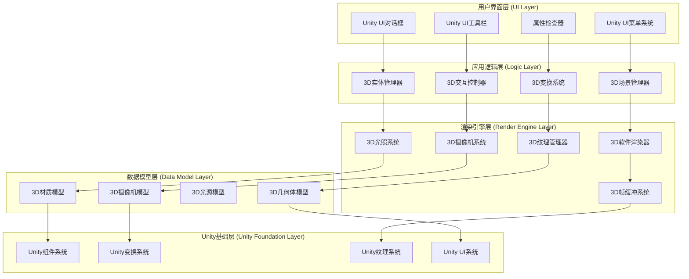
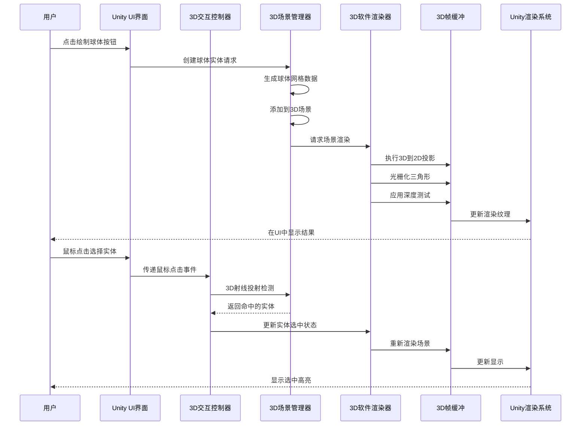
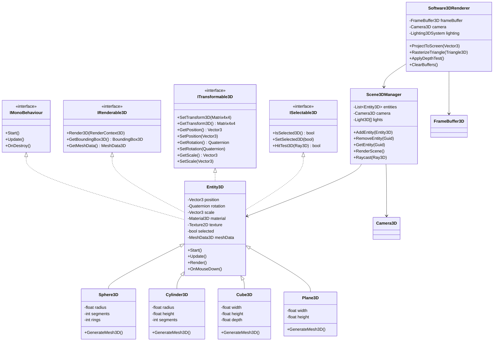

## 设计文档

## 概述

本设计文档描述了基于Unity引擎的三维图形绘制及编辑软件的技术架构。系统在Unity的2D正交摄像机视角下实现三维图形的模拟渲染，采用软件渲染思想，通过自定义渲染管线在2D纹理上绘制3D场景。

## 架构

系统采用分层架构设计：



### 组件交互流程



## 组件和接口

### 核心组件

#### 1. 3D场景管理器 (Scene3DManager)
- 管理所有3D实体的集合和层次结构
- 处理3D场景的更新和渲染请求
- 提供3D射线投射检测功能

#### 2. 3D实体基类 (Entity3D)
- 3D几何体的抽象基类，继承自MonoBehaviour
- 包含3D变换矩阵、材质和纹理属性
- 支持球体、柱体、平面、六面体等具体实现

#### 3. 3D软件渲染器 (Software3DRenderer)
- 在2D纹理上实现3D到2D的投影变换
- 执行三角形光栅化和像素填充
- 管理Z缓冲区进行深度测试
- 实现背面剔除和面法线计算

#### 4. 3D摄像机系统 (Camera3DSystem)
- 管理3D视角位置和方向
- 提供视图变换矩阵和投影矩阵
- 支持正交投影和简单的透视模拟
- 处理视角控制和观察变换

#### 5. 3D光照系统 (Lighting3DSystem)
- 实现简化的Phong光照模型
- 支持方向光和点光源
- 计算漫反射、环境光和镜面反射
- 处理阴影和光照衰减

#### 6. 3D交互控制器 (Interaction3DController)
- 处理3D空间中的鼠标和键盘输入
- 实现3D实体选择和变换操作
- 管理3D视角控制模式
- 处理3D坐标转换

#### 7. 3D帧缓冲系统 (FrameBuffer3D)
- 管理颜色缓冲和深度缓冲
- 提供像素级绘制接口
- 支持多重采样和抗锯齿
- 与Unity Texture2D集成

### 类关系图



### 接口设计

```csharp
// 核心3D接口
public interface IRenderable3D
{
    void Render3D(RenderContext3D context);
    BoundingBox3D GetBoundingBox3D();
    MeshData3D GetMeshData();
}

public interface ITransformable3D
{
    void SetTransform3D(Matrix4x4 transform);
    Matrix4x4 GetTransform3D();
    Vector3 GetPosition();
    void SetPosition(Vector3 position);
    Quaternion GetRotation();
    void SetRotation(Quaternion rotation);
    Vector3 GetScale();
    void SetScale(Vector3 scale);
}

public interface ISelectable3D
{
    bool IsSelected3D();
    void SetSelected3D(bool selected);
    bool HitTest3D(Ray3D ray);
}

// 3D渲染上下文
public struct RenderContext3D
{
    public FrameBuffer3D FrameBuffer;
    public Camera3D Camera;
    public Light3D[] Lights;
    public Matrix4x4 ViewMatrix;
    public Matrix4x4 ProjectionMatrix;
    public bool WireframeMode;
    public bool ShowNormals;
}
```

## 数据模型

### 核心数据结构

#### Vector3 - Unity内置，但添加扩展方法
```csharp
public static class Vector3Extensions
{
    public static Vector3 TransformPoint(this Vector3 point, Matrix4x4 matrix)
    {
        return matrix.MultiplyPoint(point);
    }
    
    public static Vector3 TransformDirection(this Vector3 direction, Matrix4x4 matrix)
    {
        return matrix.MultiplyVector(direction);
    }
    
    public static float Dot(this Vector3 a, Vector3 b)
    {
        return Vector3.Dot(a, b);
    }
    
    public static Vector3 Cross(this Vector3 a, Vector3 b)
    {
        return Vector3.Cross(a, b);
    }
    
    public static Vector3 Normalized(this Vector3 v)
    {
        return v.normalized;
    }
}
```

#### Matrix4x4 - Unity内置，但添加工具方法
```csharp
public static class Matrix4x4Extensions
{
    public static Matrix4x4 CreateTranslation(Vector3 translation)
    {
        return Matrix4x4.Translate(translation);
    }
    
    public static Matrix4x4 CreateRotation(Quaternion rotation)
    {
        return Matrix4x4.Rotate(rotation);
    }
    
    public static Matrix4x4 CreateScale(Vector3 scale)
    {
        return Matrix4x4.Scale(scale);
    }
    
    public static Matrix4x4 CreateTRS(Vector3 position, Quaternion rotation, Vector3 scale)
    {
        return Matrix4x4.TRS(position, rotation, scale);
    }
    
    public static Matrix4x4 CreateLookAt(Vector3 eye, Vector3 target, Vector3 up)
    {
        Vector3 z = (eye - target).normalized;
        Vector3 x = Vector3.Cross(up, z).normalized;
        Vector3 y = Vector3.Cross(z, x);
        
        return new Matrix4x4(
            new Vector4(x.x, y.x, z.x, 0),
            new Vector4(x.y, y.y, z.y, 0),
            new Vector4(x.z, y.z, z.z, 0),
            new Vector4(-Vector3.Dot(x, eye), -Vector3.Dot(y, eye), -Vector3.Dot(z, eye), 1)
        );
    }
    
    public static Matrix4x4 CreateOrthographic(float width, float height, float near, float far)
    {
        return Matrix4x4.Ortho(-width/2, width/2, -height/2, height/2, near, far);
    }
}
```

#### Entity3D 数据类
```csharp
[System.Serializable]
public class Entity3D : MonoBehaviour, IRenderable3D, ITransformable3D, ISelectable3D
{
    [Header("3D Transform")]
    [SerializeField] private Vector3 _position = Vector3.zero;
    [SerializeField] private Quaternion _rotation = Quaternion.identity;
    [SerializeField] private Vector3 _scale = Vector3.one;
    
    [Header("3D Material")]
    [SerializeField] private Material3D _material = new Material3D();
    
    [Header("3D Texture")]
    [SerializeField] private Texture2D _texture;
    [SerializeField] private TextureMapping _textureMapping = TextureMapping.UV;
    
    [Header("3D Selection")]
    [SerializeField] private bool _isSelected = false;
    
    [Header("3D Geometry")]
    [SerializeField] private MeshData3D _meshData;
    [SerializeField] private GeometryType _geometryType = GeometryType.Sphere;
    
    // 唯一标识符
    [SerializeField, HideInInspector] private string _guid;
    
    // 变换矩阵缓存
    private Matrix4x4 _transformMatrix;
    private bool _isTransformDirty = true;
    
    public string Guid => _guid;
    public GeometryType GeometryType => _geometryType;
    
    private void Awake()
    {
        // 生成唯一标识符
        if (string.IsNullOrEmpty(_guid))
        {
            _guid = System.Guid.NewGuid().ToString();
        }
        
        // 生成网格数据
        GenerateMesh();
    }
    
    private void GenerateMesh()
    {
        switch (_geometryType)
        {
            case GeometryType.Sphere:
                _meshData = MeshGenerator3D.GenerateSphere(1.0f, 16, 16);
                break;
            case GeometryType.Cylinder:
                _meshData = MeshGenerator3D.GenerateCylinder(0.5f, 2.0f, 16);
                break;
            case GeometryType.Cube:
                _meshData = MeshGenerator3D.GenerateCube(1.0f, 1.0f, 1.0f);
                break;
            case GeometryType.Plane:
                _meshData = MeshGenerator3D.GeneratePlane(2.0f, 2.0f);
                break;
        }
    }
    
    // IRenderable3D 实现
    public void Render3D(RenderContext3D context)
    {
        if (_meshData == null) return;
        
        // 更新变换矩阵
        UpdateTransformMatrix();
        
        // 渲染网格
        RenderMesh(context);
    }
    
    public BoundingBox3D GetBoundingBox3D()
    {
        if (_meshData == null) return new BoundingBox3D(Vector3.zero, Vector3.zero);
        
        UpdateTransformMatrix();
        return _meshData.GetBoundingBox().Transform(_transformMatrix);
    }
    
    public MeshData3D GetMeshData() => _meshData;
    
    // ITransformable3D 实现
    public void SetTransform3D(Matrix4x4 transform)
    {
        // 从矩阵提取位置、旋转、缩放
        _position = transform.GetPosition();
        _rotation = transform.rotation;
        _scale = transform.lossyScale;
        _isTransformDirty = true;
    }
    
    public Matrix4x4 GetTransform3D()
    {
        UpdateTransformMatrix();
        return _transformMatrix;
    }
    
    public Vector3 GetPosition() => _position;
    public void SetPosition(Vector3 position)
    {
        _position = position;
        _isTransformDirty = true;
    }
    
    public Quaternion GetRotation() => _rotation;
    public void SetRotation(Quaternion rotation)
    {
        _rotation = rotation;
        _isTransformDirty = true;
    }
    
    public Vector3 GetScale() => _scale;
    public void SetScale(Vector3 scale)
    {
        _scale = scale;
        _isTransformDirty = true;
    }
    
    // ISelectable3D 实现
    public bool IsSelected3D() => _isSelected;
    
    public void SetSelected3D(bool selected)
    {
        _isSelected = selected;
    }
    
    public bool HitTest3D(Ray3D ray)
    {
        // 简单的包围盒检测
        var bbox = GetBoundingBox3D();
        return bbox.Intersects(ray);
    }
    
    private void UpdateTransformMatrix()
    {
        if (_isTransformDirty)
        {
            _transformMatrix = Matrix4x4.TRS(_position, _rotation, _scale);
            _isTransformDirty = false;
        }
    }
    
    private void RenderMesh(RenderContext3D context)
    {
        // 获取变换后的顶点
        var vertices = _meshData.Vertices;
        var transformedVertices = new Vector3[vertices.Length];
        
        for (int i = 0; i < vertices.Length; i++)
        {
            transformedVertices[i] = _transformMatrix.MultiplyPoint(vertices[i]);
        }
        
        // 投影到屏幕空间
        var screenVertices = new Vector2[transformedVertices.Length];
        for (int i = 0; i < transformedVertices.Length; i++)
        {
            screenVertices[i] = context.Camera.WorldToScreenPoint(transformedVertices[i]);
        }
        
        // 渲染三角形
        var triangles = _meshData.Triangles;
        for (int i = 0; i < triangles.Length; i += 3)
        {
            var v0 = screenVertices[triangles[i]];
            var v1 = screenVertices[triangles[i + 1]];
            var v2 = screenVertices[triangles[i + 2]];
            
            // 背面剔除
            if (ShouldCull(v0, v1, v2)) continue;
            
            // 光栅化三角形
            RasterizeTriangle(context.FrameBuffer, v0, v1, v2, _material);
        }
    }
    
    private bool ShouldCull(Vector2 v0, Vector2 v1, Vector2 v2)
    {
        // 简单的2D背面剔除（基于三角形方向）
        float cross = (v1.x - v0.x) * (v2.y - v0.y) - (v1.y - v0.y) * (v2.x - v0.x);
        return cross <= 0; // 顺时针方向剔除
    }
    
    private void RasterizeTriangle(FrameBuffer3D frameBuffer, Vector2 v0, Vector2 v1, Vector2 v2, Material3D material)
    {
        // 三角形光栅化实现
        // 这里实现扫描线填充算法
        // 简化实现：绘制线框
        
        if (material.Wireframe)
        {
            frameBuffer.DrawLine(v0, v1, material.WireframeColor);
            frameBuffer.DrawLine(v1, v2, material.WireframeColor);
            frameBuffer.DrawLine(v2, v0, material.WireframeColor);
        }
        else
        {
            // 填充三角形
            frameBuffer.FillTriangle(v0, v1, v2, material.Color);
        }
    }
}
```

#### Material3D 材质结构
```csharp
[System.Serializable]
public struct Material3D
{
    [Header("基础颜色")]
    public Color Color;
    
    [Header("光照属性")]
    [Range(0, 1)] public float AmbientIntensity;
    [Range(0, 1)] public float DiffuseIntensity;
    [Range(0, 1)] public float SpecularIntensity;
    [Range(1, 256)] public float Shininess;
    
    [Header("线框模式")]
    public bool Wireframe;
    public Color WireframeColor;
    
    [Header("显示法线")]
    public bool ShowNormals;
    public Color NormalColor;
    public float NormalLength;
    
    public Material3D(Color color)
    {
        Color = color;
        AmbientIntensity = 0.1f;
        DiffuseIntensity = 0.7f;
        SpecularIntensity = 0.2f;
        Shininess = 32f;
        Wireframe = false;
        WireframeColor = Color.black;
        ShowNormals = false;
        NormalColor = Color.blue;
        NormalLength = 0.1f;
    }
}
```

#### Light3D 光源结构
```csharp
[System.Serializable]
public struct Light3D
{
    public LightType Type;
    public Vector3 Position;
    public Vector3 Direction;
    public Color Color;
    public float Intensity;
    public float Range;
    
    [Range(0, 1)] public float AmbientIntensity;
    [Range(0, 1)] public float DiffuseIntensity;
    [Range(0, 1)] public float SpecularIntensity;
    
    public enum LightType
    {
        Directional,
        Point,
        Spot
    }
    
    public Light3D(LightType type, Vector3 position, Color color, float intensity)
    {
        Type = type;
        Position = position;
        Direction = Vector3.down;
        Color = color;
        Intensity = intensity;
        Range = 10f;
        AmbientIntensity = 0.1f;
        DiffuseIntensity = 0.7f;
        SpecularIntensity = 0.2f;
    }
}
```

#### Camera3D 摄像机类
```csharp
public class Camera3D : MonoBehaviour
{
    [Header("投影设置")]
    public ProjectionType Projection = ProjectionType.Orthographic;
    public float OrthographicSize = 5f;
    public float FieldOfView = 60f;
    
    [Header("裁剪平面")]
    public float NearClipPlane = 0.1f;
    public float FarClipPlane = 1000f;
    
    [Header("变换")]
    public Vector3 Position = new Vector3(0, 0, -10);
    public Vector3 Target = Vector3.zero;
    public Vector3 Up = Vector3.up;
    
    [Header("控制参数")]
    public float RotationSpeed = 1f;
    public float ZoomSpeed = 5f;
    public float PanSpeed = 1f;
    
    // 矩阵缓存
    private Matrix4x4 _viewMatrix;
    private Matrix4x4 _projectionMatrix;
    private bool _isDirty = true;
    
    public enum ProjectionType
    {
        Orthographic,
        Perspective
    }
    
    private void Update()
    {
        _isDirty = true;
    }
    
    public Matrix4x4 GetViewMatrix()
    {
        if (_isDirty)
        {
            UpdateMatrices();
        }
        return _viewMatrix;
    }
    
    public Matrix4x4 GetProjectionMatrix()
    {
        if (_isDirty)
        {
            UpdateMatrices();
        }
        return _projectionMatrix;
    }
    
    public Vector2 WorldToScreenPoint(Vector3 worldPoint)
    {
        // 应用视图投影变换
        Vector4 clipPos = GetProjectionMatrix() * GetViewMatrix() * new Vector4(worldPoint.x, worldPoint.y, worldPoint.z, 1);
        
        // 透视除法
        if (Projection == ProjectionType.Perspective)
        {
            clipPos /= clipPos.w;
        }
        
        // 转换到屏幕空间 (0,0 到 1,1)
        Vector2 screenPoint = new Vector2(
            (clipPos.x + 1) * 0.5f,
            (clipPos.y + 1) * 0.5f
        );
        
        return screenPoint;
    }
    
    public Ray3D ScreenPointToRay(Vector2 screenPoint)
    {
        // 将屏幕坐标转换到NDC (-1到1)
        Vector2 ndc = new Vector2(
            screenPoint.x * 2 - 1,
            screenPoint.y * 2 - 1
        );
        
        // 反转投影变换
        Matrix4x4 invProj = GetProjectionMatrix().inverse;
        Matrix4x4 invView = GetViewMatrix().inverse;
        
        Vector4 rayEnd = invProj * new Vector4(ndc.x, ndc.y, 1, 1);
        if (Projection == ProjectionType.Perspective)
        {
            rayEnd /= rayEnd.w;
        }
        
        Vector3 rayEndWorld = invView.MultiplyPoint(new Vector3(rayEnd.x, rayEnd.y, rayEnd.z));
        Vector3 rayOrigin = Position;
        
        if (Projection == ProjectionType.Orthographic)
        {
            // 正交投影下，光线方向是固定的
            rayOrigin = invView.MultiplyPoint(new Vector3(ndc.x, ndc.y, -1));
        }
        
        Vector3 direction = (rayEndWorld - rayOrigin).normalized;
        
        return new Ray3D(rayOrigin, direction);
    }
    
    private void UpdateMatrices()
    {
        // 更新视图矩阵
        _viewMatrix = Matrix4x4Extensions.CreateLookAt(Position, Target, Up);
        
        // 更新投影矩阵
        if (Projection == ProjectionType.Orthographic)
        {
            float aspect = (float)Screen.width / Screen.height;
            float orthoWidth = OrthographicSize * aspect;
            _projectionMatrix = Matrix4x4Extensions.CreateOrthographic(orthoWidth, OrthographicSize, NearClipPlane, FarClipPlane);
        }
        else
        {
            _projectionMatrix = Matrix4x4.Perspective(FieldOfView, (float)Screen.width / Screen.height, NearClipPlane, FarClipPlane);
        }
        
        _isDirty = false;
    }
    
    // 摄像机控制方法
    public void Rotate(float deltaX, float deltaY)
    {
        // 绕Target旋转
        Vector3 direction = Position - Target;
        float distance = direction.magnitude;
        
        // 水平旋转
        Quaternion horizontalRot = Quaternion.AngleAxis(deltaX * RotationSpeed, Up);
        direction = horizontalRot * direction;
        
        // 垂直旋转（限制角度）
        Vector3 right = Vector3.Cross(Up, direction).normalized;
        Quaternion verticalRot = Quaternion.AngleAxis(deltaY * RotationSpeed, right);
        direction = verticalRot * direction;
        
        // 限制垂直角度
        float angle = Vector3.Angle(direction, Up);
        if (angle < 10 || angle > 170)
        {
            // 恢复原始方向
            return;
        }
        
        Position = Target + direction.normalized * distance;
        
        // 更新Up向量
        Up = Vector3.Cross(right, direction).normalized;
    }
    
    public void Zoom(float delta)
    {
        if (Projection == ProjectionType.Orthographic)
        {
            OrthographicSize = Mathf.Max(0.1f, OrthographicSize - delta * ZoomSpeed);
        }
        else
        {
            // 透视投影下，移动位置
            Vector3 direction = (Target - Position).normalized;
            Position += direction * delta * ZoomSpeed;
        }
        _isDirty = true;
    }
    
    public void Pan(float deltaX, float deltaY)
    {
        Vector3 right = Vector3.Cross(Up, (Target - Position).normalized).normalized;
        Vector3 up = Vector3.Cross((Target - Position).normalized, right).normalized;
        
        Vector3 offset = right * deltaX * PanSpeed + up * deltaY * PanSpeed;
        Position += offset;
        Target += offset;
        _isDirty = true;
    }
}
```

#### MeshData3D 网格数据结构
```csharp
[System.Serializable]
public class MeshData3D
{
    public Vector3[] Vertices;
    public int[] Triangles;
    public Vector3[] Normals;
    public Vector2[] UVs;
    public Color[] Colors;
    
    public MeshData3D()
    {
        Vertices = new Vector3[0];
        Triangles = new int[0];
        Normals = new Vector3[0];
        UVs = new Vector2[0];
        Colors = new Color[0];
    }
    
    public BoundingBox3D GetBoundingBox()
    {
        if (Vertices.Length == 0)
            return new BoundingBox3D(Vector3.zero, Vector3.zero);
        
        Vector3 min = Vertices[0];
        Vector3 max = Vertices[0];
        
        for (int i = 1; i < Vertices.Length; i++)
        {
            min = Vector3.Min(min, Vertices[i]);
            max = Vector3.Max(max, Vertices[i]);
        }
        
        return new BoundingBox3D(min, max);
    }
    
    public void ApplyTransform(Matrix4x4 transform)
    {
        for (int i = 0; i < Vertices.Length; i++)
        {
            Vertices[i] = transform.MultiplyPoint(Vertices[i]);
        }
        
        // 变换法线（不考虑缩放）
        Matrix4x4 normalMatrix = transform.inverse.transpose;
        for (int i = 0; i < Normals.Length; i++)
        {
            Normals[i] = normalMatrix.MultiplyVector(Normals[i]).normalized;
        }
    }
}
```

#### BoundingBox3D 包围盒结构
```csharp
[System.Serializable]
public struct BoundingBox3D
{
    public Vector3 Min;
    public Vector3 Max;
    
    public Vector3 Center => (Min + Max) * 0.5f;
    public Vector3 Size => Max - Min;
    public Vector3 Extents => Size * 0.5f;
    
    public BoundingBox3D(Vector3 min, Vector3 max)
    {
        Min = min;
        Max = max;
    }
    
    public bool Contains(Vector3 point)
    {
        return point.x >= Min.x && point.x <= Max.x &&
               point.y >= Min.y && point.y <= Max.y &&
               point.z >= Min.z && point.z <= Max.z;
    }
    
    public bool Intersects(Ray3D ray)
    {
        // 简化实现：检查射线与AABB相交
        Vector3 invDir = new Vector3(
            1.0f / ray.Direction.x,
            1.0f / ray.Direction.y,
            1.0f / ray.Direction.z
        );
        
        float t1 = (Min.x - ray.Origin.x) * invDir.x;
        float t2 = (Max.x - ray.Origin.x) * invDir.x;
        float t3 = (Min.y - ray.Origin.y) * invDir.y;
        float t4 = (Max.y - ray.Origin.y) * invDir.y;
        float t5 = (Min.z - ray.Origin.z) * invDir.z;
        float t6 = (Max.z - ray.Origin.z) * invDir.z;
        
        float tmin = Mathf.Max(Mathf.Max(Mathf.Min(t1, t2), Mathf.Min(t3, t4)), Mathf.Min(t5, t6));
        float tmax = Mathf.Min(Mathf.Min(Mathf.Max(t1, t2), Mathf.Max(t3, t4)), Mathf.Max(t5, t6));
        
        // 如果tmax < 0，射线在盒子后面
        if (tmax < 0) return false;
        
        // 如果tmin > tmax，没有相交
        if (tmin > tmax) return false;
        
        return true;
    }
    
    public BoundingBox3D Transform(Matrix4x4 transform)
    {
        // 变换8个角点
        Vector3[] corners = new Vector3[8];
        corners[0] = new Vector3(Min.x, Min.y, Min.z);
        corners[1] = new Vector3(Max.x, Min.y, Min.z);
        corners[2] = new Vector3(Min.x, Max.y, Min.z);
        corners[3] = new Vector3(Max.x, Max.y, Min.z);
        corners[4] = new Vector3(Min.x, Min.y, Max.z);
        corners[5] = new Vector3(Max.x, Min.y, Max.z);
        corners[6] = new Vector3(Min.x, Max.y, Max.z);
        corners[7] = new Vector3(Max.x, Max.y, Max.z);
        
        Vector3 min = transform.MultiplyPoint(corners[0]);
        Vector3 max = min;
        
        for (int i = 1; i < 8; i++)
        {
            Vector3 transformed = transform.MultiplyPoint(corners[i]);
            min = Vector3.Min(min, transformed);
            max = Vector3.Max(max, transformed);
        }
        
        return new BoundingBox3D(min, max);
    }
}
```

#### Ray3D 射线结构
```csharp
[System.Serializable]
public struct Ray3D
{
    public Vector3 Origin;
    public Vector3 Direction;
    
    public Ray3D(Vector3 origin, Vector3 direction)
    {
        Origin = origin;
        Direction = direction.normalized;
    }
    
    public Vector3 GetPoint(float distance)
    {
        return Origin + Direction * distance;
    }
}
```

### 3D网格生成器
```csharp
public static class MeshGenerator3D
{
    public static MeshData3D GenerateSphere(float radius, int segments, int rings)
    {
        List<Vector3> vertices = new List<Vector3>();
        List<Vector3> normals = new List<Vector3>();
        List<Vector2> uvs = new List<Vector2>();
        List<int> triangles = new List<int>();
        
        for (int ring = 0; ring <= rings; ring++)
        {
            float v = (float)ring / rings;
            float phi = v * Mathf.PI;
            
            for (int segment = 0; segment <= segments; segment++)
            {
                float u = (float)segment / segments;
                float theta = u * Mathf.PI * 2;
                
                float x = Mathf.Sin(phi) * Mathf.Cos(theta);
                float y = Mathf.Cos(phi);
                float z = Mathf.Sin(phi) * Mathf.Sin(theta);
                
                Vector3 vertex = new Vector3(x, y, z) * radius;
                vertices.Add(vertex);
                normals.Add(vertex.normalized);
                uvs.Add(new Vector2(u, v));
                
                if (ring < rings && segment < segments)
                {
                    int current = ring * (segments + 1) + segment;
                    int next = current + segments + 1;
                    
                    triangles.Add(current);
                    triangles.Add(next + 1);
                    triangles.Add(next);
                    
                    triangles.Add(current);
                    triangles.Add(current + 1);
                    triangles.Add(next + 1);
                }
            }
        }
        
        return new MeshData3D
        {
            Vertices = vertices.ToArray(),
            Triangles = triangles.ToArray(),
            Normals = normals.ToArray(),
            UVs = uvs.ToArray(),
            Colors = Enumerable.Repeat(Color.white, vertices.Count).ToArray()
        };
    }
    
    public static MeshData3D GenerateCylinder(float radius, float height, int segments)
    {
        List<Vector3> vertices = new List<Vector3>();
        List<Vector3> normals = new List<Vector3>();
        List<Vector2> uvs = new List<Vector2>();
        List<int> triangles = new List<int>();
        
        float halfHeight = height * 0.5f;
        
        // 顶部圆盘
        vertices.Add(new Vector3(0, halfHeight, 0));
        normals.Add(Vector3.up);
        uvs.Add(new Vector2(0.5f, 0.5f));
        
        for (int i = 0; i <= segments; i++)
        {
            float angle = (float)i / segments * Mathf.PI * 2;
            float x = Mathf.Cos(angle) * radius;
            float z = Mathf.Sin(angle) * radius;
            
            vertices.Add(new Vector3(x, halfHeight, z));
            normals.Add(Vector3.up);
            uvs.Add(new Vector2(
                0.5f + Mathf.Cos(angle) * 0.5f,
                0.5f + Mathf.Sin(angle) * 0.5f
            ));
        }
        
        // 底部圆盘
        vertices.Add(new Vector3(0, -halfHeight, 0));
        normals.Add(Vector3.down);
        uvs.Add(new Vector2(0.5f, 0.5f));
        
        int bottomCenterIndex = vertices.Count - 1;
        
        for (int i = 0; i <= segments; i++)
        {
            float angle = (float)i / segments * Mathf.PI * 2;
            float x = Mathf.Cos(angle) * radius;
            float z = Mathf.Sin(angle) * radius;
            
            vertices.Add(new Vector3(x, -halfHeight, z));
            normals.Add(Vector3.down);
            uvs.Add(new Vector2(
                0.5f + Mathf.Cos(angle) * 0.5f,
                0.5f + Mathf.Sin(angle) * 0.5f
            ));
        }
        
        // 侧面
        int sideStartIndex = vertices.Count;
        
        for (int i = 0; i <= segments; i++)
        {
            float angle = (float)i / segments * Mathf.PI * 2;
            float x = Mathf.Cos(angle);
            float z = Mathf.Sin(angle);
            
            // 顶部环
            vertices.Add(new Vector3(x * radius, halfHeight, z * radius));
            normals.Add(new Vector3(x, 0, z));
            uvs.Add(new Vector2((float)i / segments, 1));
            
            // 底部环
            vertices.Add(new Vector3(x * radius, -halfHeight, z * radius));
            normals.Add(new Vector3(x, 0, z));
            uvs.Add(new Vector2((float)i / segments, 0));
        }
        
        // 生成三角形
        // 顶部圆盘
        for (int i = 1; i <= segments; i++)
        {
            triangles.Add(0);
            triangles.Add(i);
            triangles.Add(i + 1);
        }
        
        // 底部圆盘
        for (int i = 1; i <= segments; i++)
        {
            triangles.Add(bottomCenterIndex);
            triangles.Add(bottomCenterIndex + i + 1);
            triangles.Add(bottomCenterIndex + i);
        }
        
        // 侧面
        for (int i = 0; i < segments; i++)
        {
            int topLeft = sideStartIndex + i * 2;
            int topRight = sideStartIndex + (i + 1) * 2;
            int bottomLeft = topLeft + 1;
            int bottomRight = topRight + 1;
            
            triangles.Add(topLeft);
            triangles.Add(topRight);
            triangles.Add(bottomLeft);
            
            triangles.Add(bottomLeft);
            triangles.Add(topRight);
            triangles.Add(bottomRight);
        }
        
        return new MeshData3D
        {
            Vertices = vertices.ToArray(),
            Triangles = triangles.ToArray(),
            Normals = normals.ToArray(),
            UVs = uvs.ToArray(),
            Colors = Enumerable.Repeat(Color.white, vertices.Count).ToArray()
        };
    }
    
    public static MeshData3D GenerateCube(float width, float height, float depth)
    {
        float halfWidth = width * 0.5f;
        float halfHeight = height * 0.5f;
        float halfDepth = depth * 0.5f;
        
        Vector3[] vertices = new Vector3[]
        {
            // 前面
            new Vector3(-halfWidth, -halfHeight, halfDepth),
            new Vector3(halfWidth, -halfHeight, halfDepth),
            new Vector3(halfWidth, halfHeight, halfDepth),
            new Vector3(-halfWidth, halfHeight, halfDepth),
            
            // 后面
            new Vector3(-halfWidth, -halfHeight, -halfDepth),
            new Vector3(halfWidth, -halfHeight, -halfDepth),
            new Vector3(halfWidth, halfHeight, -halfDepth),
            new Vector3(-halfWidth, halfHeight, -halfDepth),
            
            // 左面
            new Vector3(-halfWidth, -halfHeight, -halfDepth),
            new Vector3(-halfWidth, -halfHeight, halfDepth),
            new Vector3(-halfWidth, halfHeight, halfDepth),
            new Vector3(-halfWidth, halfHeight, -halfDepth),
            
            // 右面
            new Vector3(halfWidth, -halfHeight, halfDepth),
            new Vector3(halfWidth, -halfHeight, -halfDepth),
            new Vector3(halfWidth, halfHeight, -halfDepth),
            new Vector3(halfWidth, halfHeight, halfDepth),
            
            // 顶面
            new Vector3(-halfWidth, halfHeight, halfDepth),
            new Vector3(halfWidth, halfHeight, halfDepth),
            new Vector3(halfWidth, halfHeight, -halfDepth),
            new Vector3(-halfWidth, halfHeight, -halfDepth),
            
            // 底面
            new Vector3(-halfWidth, -halfHeight, -halfDepth),
            new Vector3(halfWidth, -halfHeight, -halfDepth),
            new Vector3(halfWidth, -halfHeight, halfDepth),
            new Vector3(-halfWidth, -halfHeight, halfDepth),
        };
        
        Vector3[] normals = new Vector3[]
        {
            // 前面
            Vector3.forward, Vector3.forward, Vector3.forward, Vector3.forward,
            // 后面
            Vector3.back, Vector3.back, Vector3.back, Vector3.back,
            // 左面
            Vector3.left, Vector3.left, Vector3.left, Vector3.left,
            // 右面
            Vector3.right, Vector3.right, Vector3.right, Vector3.right,
            // 顶面
            Vector3.up, Vector3.up, Vector3.up, Vector3.up,
            // 底面
            Vector3.down, Vector3.down, Vector3.down, Vector3.down,
        };
        
        Vector2[] uvs = new Vector2[]
        {
            // 前面
            new Vector2(0, 0), new Vector2(1, 0), new Vector2(1, 1), new Vector2(0, 1),
            // 后面
            new Vector2(1, 0), new Vector2(0, 0), new Vector2(0, 1), new Vector2(1, 1),
            // 左面
            new Vector2(0, 0), new Vector2(1, 0), new Vector2(1, 1), new Vector2(0, 1),
            // 右面
            new Vector2(0, 0), new Vector2(1, 0), new Vector2(1, 1), new Vector2(0, 1),
            // 顶面
            new Vector2(0, 1), new Vector2(1, 1), new Vector2(1, 0), new Vector2(0, 0),
            // 底面
            new Vector2(1, 1), new Vector2(0, 1), new Vector2(0, 0), new Vector2(1, 0),
        };
        
        int[] triangles = new int[]
        {
            // 前面
            0, 1, 2, 2, 3, 0,
            // 后面
            4, 5, 6, 6, 7, 4,
            // 左面
            8, 9, 10, 10, 11, 8,
            // 右面
            12, 13, 14, 14, 15, 12,
            // 顶面
            16, 17, 18, 18, 19, 16,
            // 底面
            20, 21, 22, 22, 23, 20
        };
        
        return new MeshData3D
        {
            Vertices = vertices,
            Triangles = triangles,
            Normals = normals,
            UVs = uvs,
            Colors = Enumerable.Repeat(Color.white, vertices.Length).ToArray()
        };
    }
    
    public static MeshData3D GeneratePlane(float width, float height)
    {
        float halfWidth = width * 0.5f;
        float halfHeight = height * 0.5f;
        
        Vector3[] vertices = new Vector3[]
        {
            new Vector3(-halfWidth, -halfHeight, 0),
            new Vector3(halfWidth, -halfHeight, 0),
            new Vector3(halfWidth, halfHeight, 0),
            new Vector3(-halfWidth, halfHeight, 0)
        };
        
        Vector3[] normals = new Vector3[]
        {
            Vector3.forward,
            Vector3.forward,
            Vector3.forward,
            Vector3.forward
        };
        
        Vector2[] uvs = new Vector2[]
        {
            new Vector2(0, 0),
            new Vector2(1, 0),
            new Vector2(1, 1),
            new Vector2(0, 1)
        };
        
        int[] triangles = new int[]
        {
            0, 1, 2,
            2, 3, 0
        };
        
        return new MeshData3D
        {
            Vertices = vertices,
            Triangles = triangles,
            Normals = normals,
            UVs = uvs,
            Colors = Enumerable.Repeat(Color.white, vertices.Length).ToArray()
        };
    }
}
```

## 正确性属性

基于需求分析，以下是系统必须满足的正确性属性：

### 属性 1: 3D图形绘制和显示一致性
*对于任何*几何体类型和绘制操作，当用户触发绘制命令时，3D场景中应该添加相应的实体对象，并且该对象应该在视口中可见
**验证: 需求 1.1, 1.5**

### 属性 2: 3D场景实体管理
*对于任何*3D实体集合，当多个图形被添加到场景中时，3D场景管理器应该包含所有这些实体，并为每个实体分配唯一的标识符
**验证: 需求 1.3, 1.4**

### 属性 3: 3D实体选择唯一性
*对于任何*3D场景状态，系统应该最多只有一个实体处于选中状态，当选择新实体时应该取消之前的选择
**验证: 需求 2.1, 2.4, 2.5**

### 属性 4: 鼠标交互3D变换
*对于任何*选中的3D实体，鼠标拖拽操作应该相应地改变实体的位置坐标，滚轮操作应该改变Z轴坐标
**验证: 需求 2.2, 2.3**

### 属性 5: 3D变换参数设置
*对于任何*3D实体和变换参数（位置、旋转、缩放），当用户通过对话框修改这些参数时，实体的变换矩阵应该相应更新，并立即反映在视口显示中
**验证: 需求 3.2, 3.3, 3.4, 3.5**

### 属性 6: 3D摄像机控制响应
*对于任何*摄像机状态，鼠标拖拽应该改变3D摄像机的视角方向，滚轮操作应该改变摄像机距离，所有变化应该实时更新视口显示
**验证: 需求 4.2, 4.3, 4.4**

### 属性 7: 3D光照参数影响
*对于任何*3D光源参数变化（位置、强度），系统应该更新光照计算并重新渲染所有受影响的实体
**验证: 需求 5.2, 5.3, 5.4**

### 属性 8: 3D材质独立性
*对于任何*3D实体，修改其材质参数（颜色、反射系数）应该只影响该实体的显示效果，不应影响其他实体，变化应该立即在视口中可见
**验证: 需求 6.2, 6.3, 6.4, 6.5**

### 属性 9: 3D纹理处理正确性
*对于任何*有效的3D纹理文件和映射方式，系统应该正确加载纹理并应用到实体表面；对于无效文件，应该显示错误信息并保持原有状态
**验证: 需求 7.2, 7.3, 7.4, 7.5**

## 错误处理

### 输入验证
- 所有用户输入的数值参数必须在合理范围内
- 3D坐标必须在有效空间范围内
- 纹理文件路径必须经过有效性检查

### 资源管理
- 3D网格生成失败时提供默认网格
- 纹理加载失败时提供默认颜色
- 内存不足时优雅降级处理

### 渲染错误
- Z缓冲区溢出保护
- 除零错误防护（在矩阵运算中）
- 无效变换矩阵的检测和修正
- 3D到2D投影的边界检查

### 交互错误
- 3D射线投射失败处理
- 无效实体选择处理
- 视角控制边界限制

## 测试策略

### 双重测试方法

系统将采用单元测试和基于属性的测试相结合的方法：

#### 单元测试
- 验证特定3D几何体生成
- 测试3D变换矩阵运算
- 覆盖3D到2D投影边界情况
- 验证UI对话框的正确显示
- 测试3D射线投射和选择

#### 基于属性的测试
- 使用Unity Test Framework进行基于属性的测试
- 每个属性测试配置为运行最少100次迭代
- 每个基于属性的测试必须用注释明确引用设计文档中的正确性属性
- 测试标签格式：**Feature: 3d-graphics-editor, Property {number}: {property_text}**
- 每个正确性属性必须由单个基于属性的测试实现

#### 测试覆盖范围
- 单元测试捕获具体3D计算错误，属性测试验证通用正确性
- 两种测试类型互补，提供全面覆盖
- 单元测试处理特定示例，属性测试处理大量3D输入

### 测试数据生成
- 随机生成3D几何体参数（位置、旋转、缩放）
- 随机生成3D材质和光照参数
- 模拟各种3D鼠标输入序列
- 生成有效和无效的3D纹理文件路径

### 性能测试
- 大量3D实体场景的渲染性能
- 复杂3D光照计算的响应时间
- 3D到2D投影的计算效率
- 内存使用情况监控

### 3D特定测试
```csharp
using NUnit.Framework;
using UnityEngine;
using UnityEngine.TestTools;

[TestFixture]
public class Graphics3DAlgorithmTests
{
    [Test]
    public void Test3DSphereGeneration()
    {
        // 测试球体网格生成
        MeshData3D sphere = MeshGenerator3D.GenerateSphere(1.0f, 16, 16);
        
        Assert.IsNotNull(sphere, "球体网格不应为空");
        Assert.Greater(sphere.Vertices.Length, 0, "球体应包含顶点");
        Assert.Greater(sphere.Triangles.Length, 0, "球体应包含三角形");
        Assert.AreEqual(sphere.Vertices.Length, sphere.Normals.Length, "每个顶点应有法线");
        
        // 验证顶点在球体表面上
        foreach (var vertex in sphere.Vertices)
        {
            float distance = vertex.magnitude;
            Assert.AreEqual(1.0f, distance, 0.01f, $"顶点 {vertex} 应在半径为1的球面上");
        }
    }
    
    [Test]
    public void Test3DTransformMatrix()
    {
        // 测试3D变换矩阵
        Vector3 position = new Vector3(1, 2, 3);
        Quaternion rotation = Quaternion.Euler(45, 0, 0);
        Vector3 scale = new Vector3(2, 2, 2);
        
        Matrix4x4 transform = Matrix4x4.TRS(position, rotation, scale);
        
        // 测试变换点
        Vector3 originalPoint = new Vector3(0.5f, 0.5f, 0.5f);
        Vector3 transformedPoint = transform.MultiplyPoint(originalPoint);
        
        // 手动计算期望值
        Vector3 scaledPoint = Vector3.Scale(originalPoint, scale);
        Vector3 rotatedPoint = rotation * scaledPoint;
        Vector3 expectedPoint = rotatedPoint + position;
        
        Assert.AreEqual(expectedPoint.x, transformedPoint.x, 0.001f, "X坐标变换不正确");
        Assert.AreEqual(expectedPoint.y, transformedPoint.y, 0.001f, "Y坐标变换不正确");
        Assert.AreEqual(expectedPoint.z, transformedPoint.z, 0.001f, "Z坐标变换不正确");
    }
    
    [Test]
    public void Test3DCameraProjection()
    {
        // 测试3D摄像机投影
        Camera3D camera = new GameObject("TestCamera").AddComponent<Camera3D>();
        camera.Projection = Camera3D.ProjectionType.Orthographic;
        camera.OrthographicSize = 5f;
        camera.Position = new Vector3(0, 0, -10);
        camera.Target = Vector3.zero;
        
        // 测试世界点到屏幕点转换
        Vector3 worldPoint = new Vector3(0, 0, 0);
        Vector2 screenPoint = camera.WorldToScreenPoint(worldPoint);
        
        // 中心点应该投影到屏幕中心 (0.5, 0.5)
        Assert.AreEqual(0.5f, screenPoint.x, 0.01f, "中心点X坐标应为0.5");
        Assert.AreEqual(0.5f, screenPoint.y, 0.01f, "中心点Y坐标应为0.5");
        
        GameObject.DestroyImmediate(camera.gameObject);
    }
    
    [Test]
    public void Test3DRaycastSelection()
    {
        // 测试3D射线投射选择
        Entity3D entity = new GameObject("TestEntity").AddComponent<Entity3D>();
        entity.SetPosition(new Vector3(0, 0, 0));
        entity.SetScale(new Vector3(1, 1, 1));
        
        // 创建从摄像机指向实体的射线
        Ray3D ray = new Ray3D(
            new Vector3(0, 0, -10),
            new Vector3(0, 0, 1)
        );
        
        bool hit = entity.HitTest3D(ray);
        
        Assert.IsTrue(hit, "射线应该击中实体");
        
        // 测试射线在实体后方的情况
        Ray3D rayBehind = new Ray3D(
            new Vector3(0, 0, 10),
            new Vector3(0, 0, -1)
        );
        
        bool hitBehind = entity.HitTest3D(rayBehind);
        
        Assert.IsTrue(hitBehind, "从后方来的射线也应该击中实体");
        
        GameObject.DestroyImmediate(entity.gameObject);
    }
    
    [Test]
    public void Property_3DTransformMatrixConsistency()
    {
        // 属性：对于任意3D实体和变换矩阵，应用变换后实体的坐标应该与矩阵乘法结果一致
        // 验证：需求 5.2, 5.3, 5.4
        
        System.Random random = new System.Random();
        
        for (int i = 0; i < 50; i++) // 运行50次随机测试
        {
            // 生成随机3D实体
            Entity3D entity = new GameObject().AddComponent<Entity3D>();
            
            // 生成随机变换
            Vector3 position = new Vector3(
                (float)random.NextDouble() * 20 - 10,
                (float)random.NextDouble() * 20 - 10,
                (float)random.NextDouble() * 20 - 10
            );
            
            Quaternion rotation = Quaternion.Euler(
                (float)random.NextDouble() * 360,
                (float)random.NextDouble() * 360,
                (float)random.NextDouble() * 360
            );
            
            Vector3 scale = new Vector3(
                (float)random.NextDouble() * 3 + 0.5f,
                (float)random.NextDouble() * 3 + 0.5f,
                (float)random.NextDouble() * 3 + 0.5f
            );
            
            // 应用变换
            entity.SetPosition(position);
            entity.SetRotation(rotation);
            entity.SetScale(scale);
            
            // 获取变换矩阵
            Matrix4x4 transform = entity.GetTransform3D();
            
            // 验证矩阵正确性
            Matrix4x4 expected = Matrix4x4.TRS(position, rotation, scale);
            
            for (int row = 0; row < 4; row++)
            {
                for (int col = 0; col < 4; col++)
                {
                    Assert.AreEqual(expected[row, col], transform[row, col], 0.001f,
                        $"矩阵元素[{row},{col}]不正确");
                }
            }
            
            GameObject.DestroyImmediate(entity.gameObject);
        }
    }
    
    [Test]
    public void Property_3DSelectionUniqueness()
    {
        // 属性：对于任何3D场景状态，系统应该最多只有一个实体处于选中状态
        // 验证：需求 2.5
        
        Scene3DManager sceneManager = new GameObject("TestScene").AddComponent<Scene3DManager>();
        
        // 创建多个3D实体
        List<Entity3D> entities = new List<Entity3D>();
        for (int i = 0; i < 10; i++)
        {
            Entity3D entity = new GameObject($"Entity{i}").AddComponent<Entity3D>();
            entity.SetPosition(new Vector3(i * 2, 0, 0));
            sceneManager.AddEntity(entity);
            entities.Add(entity);
        }
        
        // 随机选择实体
        System.Random random = new System.Random();
        for (int i = 0; i < 20; i++)
        {
            int index = random.Next(entities.Count);
            entities[index].SetSelected3D(true);
            
            // 验证只有一个实体被选中
            int selectedCount = 0;
            foreach (var entity in entities)
            {
                if (entity.IsSelected3D())
                    selectedCount++;
            }
            
            Assert.LessOrEqual(selectedCount, 1, $"第{i}次选择后，应有最多1个实体被选中，实际有{selectedCount}个");
            
            // 清除所有选择
            foreach (var entity in entities)
            {
                entity.SetSelected3D(false);
            }
        }
        
        GameObject.DestroyImmediate(sceneManager.gameObject);
        foreach (var entity in entities)
        {
            GameObject.DestroyImmediate(entity.gameObject);
        }
    }
}
```

这个设计文档提供了完整的Unity 3D图形编辑器实现方案，涵盖了从基础数据结构到高级渲染算法的所有方面。系统在Unity的2D正交摄像机视角下模拟3D渲染，专注于图形学原理的实现，适合作为图形学实验和学习工具。
